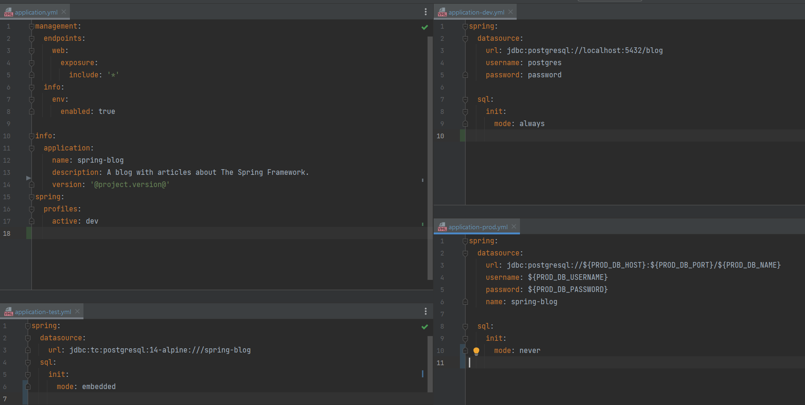
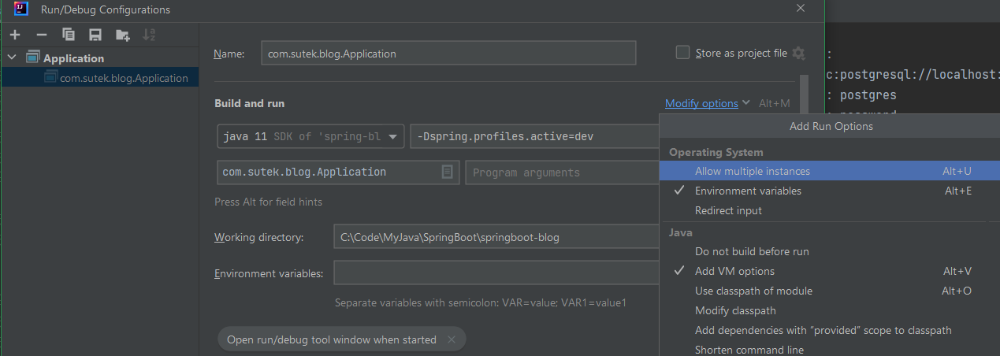
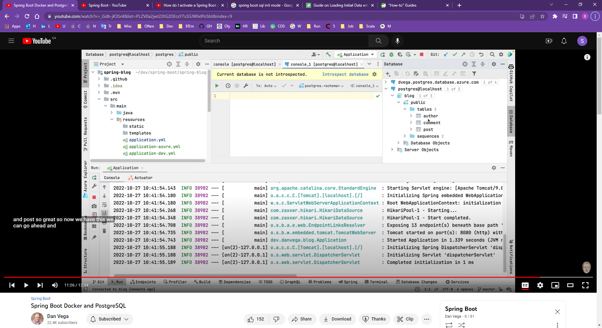
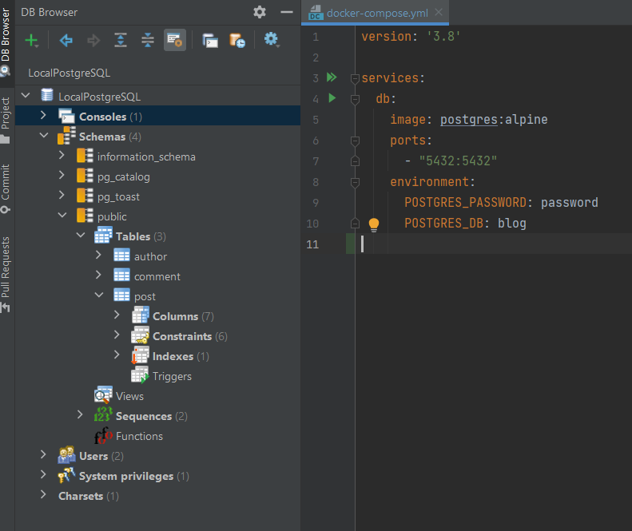

# My Spring Boot

## Reactive Spring Boot problems

Reactive Spring Boot supposed to be better than non-Reactive Spring Boot!

However, it has a few big issues as of today - Apr 2023!

- Composite Keys is not supported

- Needs Redis for adding cache

## How to configure Sping Boot app for multiple environments

Use Spring Boot profiles!

`-Dspring.profiles.active=dev` ...



VM options



e.g.

- local
- dev
- qat
- uatE
- preprod
- prod

<==>

- application.properties  (containing common properties)
- application-local.properties
- application-dev.properties
- application-qat.properties
- application-uat.properties
- application-preprod.properties
- application-prod.properties

## How to set the default profile

```yml
spring:
  profiles:
    active: local
```

## How to use Docker and PostgreSQL together

docker-compose.yml

```yml
version: '3.8'

services:
  db:
    image: postgres:alpine
    ports:
      - "5432:5432"
    environment:
      POSTGRES_PASSWORD: password
      POSTGRES_DB: blog
```

`docker compose up`





## Misc

### Customizing Database Schema Creation

By default, Spring Boot automatically creates the schema of an embedded DataSource.

If we need to control or customize this behavior, we can use the property spring.sql.init.mode. This property takes one of three values:

```dos
always – always initialize the database
embedded – always initialize if an embedded database is in use. This is the default if the property value is not specified.
never – never initialize the database
```
