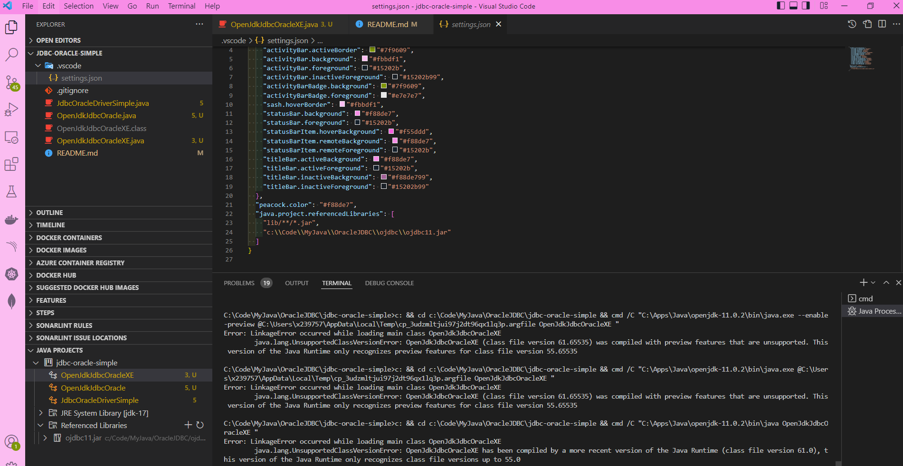

# Mind the ojdbc version of Oracle Drivers


## VSCode Java how to add jar to classpath




## JdbcOracleDriverSimple

JDK 17

```
C:\Code\MyJava\OracleJDBC\jdbc-oracle-simple> cmd /C "C:\Apps\Java\jdk-17\bin\java.exe --enable-preview -XX:+ShowCodeDetailsInExceptionMessages -cp C:\Users\x239757\AppData\Roaming\Code\User\workspaceStorage\e5d90add0af33ae1439e4f5d3fb20128\redhat.java\jdt_ws\jdbc-oracle-simple_a3b9ec8e\bin JdbcOracleDriverSimple "
java.lang.ClassNotFoundException: oracle.jdbc.driver.OracleDriver
```

JDK 17 + ojdbc10.jar

```
C:\Code\MyJava\OracleJDBC\jdbc-oracle-simple> cmd /C "C:\Apps\Java\jdk-17\bin\java.exe --enable-preview -XX:+ShowCodeDetailsInExceptionMessages -cp C:\Users\x239757\AppData\Roaming\Code\User\workspaceStorage\e5d90add0af33ae1439e4f5d3fb20128\redhat.java\jdt_ws\jdbc-oracle-simple_a3b9ec8e\bin;C:\Code\MyJava\OracleJDBC\ojdbc\ojdbc10.jar JdbcOracleDriverSimple "
java.sql.SQLRecoverableException: IO Error: The Network Adapter could not establish the connection
```

JDK 17 + ojdbc8.jar

```
C:\Code\MyJava\OracleJDBC\jdbc-oracle-simple>cmd /C "C:\Apps\Java\jdk-17\bin\java.exe --enable-preview -XX:+ShowCodeDetailsInExceptionMessages -cp C:\Users\x239757\AppData\Roaming\Code\User\workspaceStorage\e5d90add0af33ae1439e4f5d3fb20128\redhat.java\jdt_ws\jdbc-oracle-simple_a3b9ec8e\bin;C:\Code\MyJava\OracleJDBC\ojdbc\ojdbc8.jar JdbcOracleDriverSimple "
java.sql.SQLRecoverableException: IO Error: The Network Adapter could not establish the connection (CONNECTION_ID=NJNp/MRoTS6wphgW8v445g==)
```

JDK 17 + ojdbc11.jar

```
C:\Code\MyJava\OracleJDBC\jdbc-oracle-simple>cmd /C "C:\Apps\Java\jdk-17\bin\java.exe --enable-preview -XX:+ShowCodeDetailsInExceptionMessages -cp C:\Users\x239757\AppData\Roaming\Code\User\workspaceStorage\e5d90add0af33ae1439e4f5d3fb20128\redhat.java\jdt_ws\jdbc-oracle-simple_a3b9ec8e\bin;C:\Code\MyJava\OracleJDBC\ojdbc\ojdbc11.jar JdbcOracleDriverSimple "
java.sql.SQLRecoverableException: IO Error: The Network Adapter could not establish the connection (CONNECTION_ID=z/D+oVIIQbaX80sxICTCIw==)
```

Open JDK 11 + ojdbc11.jar

```
C:\Code\MyJava\OracleJDBC\jdbc-oracle-simple>cmd /C "C:\Apps\Java\openjdk-11.0.2\bin\java.exe --enable-preview -XX:+ShowCodeDetailsInExceptionMessages -cp C:\Users\x239757\AppData\Roaming\Code\User\workspaceStorage\e5d90add0af33ae1439e4f5d3fb20128\redhat.java\jdt_ws\jdbc-oracle-simple_a3b9ec8e\bin;C:\Code\MyJava\OracleJDBC\ojdbc\ojdbc11.jar JdbcOracleDriverSimple "
Unrecognized VM option 'ShowCodeDetailsInExceptionMessages'
Error: Could not create the Java Virtual Machine.
Error: A fatal exception has occurred. Program will exit.
```

```
C:\Code\MyJava\OracleJDBC\jdbc-oracle-simple>cmd /C "C:\Apps\Java\openjdk-11.0.2\bin\java.exe --enable-preview -XX:+ShowCodeDetailsInExceptionMessages -cp C:\Code\MyJava\OracleJDBC\ojdbc\ojdbc11.jar JdbcOracleDriverSimple "
Unrecognized VM option 'ShowCodeDetailsInExceptionMessages'
Error: Could not create the Java Virtual Machine.
Error: A fatal exception has occurred. Program will exit.

C:\Code\MyJava\OracleJDBC\jdbc-oracle-simple>cmd /C "C:\Apps\Java\openjdk-11.0.2\bin\java.exe --enable-preview -XX:+ShowCodeDetailsInExceptionMessages -cp C:\Code\MyJava\OracleJDBC\ojdbc\ojdbc11.jar JdbcOracleDriverSimple "
Unrecognized VM option 'ShowCodeDetailsInExceptionMessages'
Error: Could not create the Java Virtual Machine.
Error: A fatal exception has occurred. Program will exit.

C:\Code\MyJava\OracleJDBC\jdbc-oracle-simple>cmd /C "C:\Apps\Java\openjdk-11.0.2\bin\java.exe --enable-preview -XX:+ShowCodeDetailsInExceptionMessages -cp C:\Code\MyJava\OracleJDBC\ojdbc\ojdbc10.jar JdbcOracleDriverSimple "
Unrecognized VM option 'ShowCodeDetailsInExceptionMessages'
Error: Could not create the Java Virtual Machine.
Error: A fatal exception has occurred. Program will exit.

C:\Code\MyJava\OracleJDBC\jdbc-oracle-simple>cmd /C "C:\Apps\Java\openjdk-11.0.2\bin\java.exe --enable-preview -XX:+ShowCodeDetailsInExceptionMessages -cp C:\Code\MyJava\OracleJDBC\ojdbc\ojdbc8.jar JdbcOracleDriverSimple "
Unrecognized VM option 'ShowCodeDetailsInExceptionMessages'
Error: Could not create the Java Virtual Machine.
Error: A fatal exception has occurred. Program will exit.
```

Weird

```
C:\Code\MyJava\OracleJDBC\jdbc-oracle-simple>cmd /C "C:\Apps\Java\openjdk-11.0.2\bin\java.exe -cp C:\Code\MyJava\OracleJDBC\ojdbc\ojdbc11.jar JdbcOracleDriverSimple "
Error: Could not find or load main class JdbcOracleDriverSimple
Caused by: java.lang.ClassNotFoundException: JdbcOracleDriverSimple

C:\Code\MyJava\OracleJDBC\jdbc-oracle-simple>C:\Apps\Java\openjdk-11.0.2\bin\java.exe -cp C:\Code\MyJava\OracleJDBC\ojdbc\ojdbc11.jar JdbcOracleDriverSimple
Error: Could not find or load main class JdbcOracleDriverSimple
Caused by: java.lang.ClassNotFoundException: JdbcOracleDriverSimple
```

## OpenJdkJdbcOracle

```
C:\Code\MyJava\OracleJDBC\jdbc-oracle-simple> c: && cd c:\Code\MyJava\OracleJDBC\jdbc-oracle-simple && cmd /C "C:\Apps\Java\jdk-17\bin\java.exe --enable-preview -XX:+ShowCodeDetailsInExceptionMessages -cp C:\Users\x239757\AppData\Roaming\Code\User\workspaceStorage\e5d90add0af33ae1439e4f5d3fb20128\redhat.java\jdt_ws\jdbc-oracle-simple_a3b9ec8e\bin OpenJdkJdbcOracle "
java.sql.SQLException: No suitable driver found for jdbc:oracle:thin:@//localhost:1521/xe

C:\Code\MyJava\OracleJDBC\jdbc-oracle-simple> c: && cd c:\Code\MyJava\OracleJDBC\jdbc-oracle-simple && cmd /C "C:\Apps\Java\jdk-17\bin\java.exe --enable-preview -XX:+ShowCodeDetailsInExceptionMessages -cp C:\Users\x239757\AppData\Roaming\Code\User\workspaceStorage\e5d90add0af33ae1439e4f5d3fb20128\redhat.java\jdt_ws\jdbc-oracle-simple_a3b9ec8e\bin;C:\Code\MyJava\OracleJDBC\ojdbc\ojdbc11.jar OpenJdkJdbcOracle "
java.sql.SQLRecoverableException: IO Error: The Network Adapter could not establish the connection (CONNECTION_ID=YJmepFBeSSyMi8BcIT50Fw==)
```

```
C:\Code\MyJava\OracleJDBC\jdbc-oracle-simple>cmd /C "C:\Apps\Java\openjdk-11.0.2\bin\java.exe --enable-preview -XX:+ShowCodeDetailsInExceptionMessages -cp C:\Users\x239757\AppData\Roaming\Code\User\workspaceStorage\e5d90add0af33ae1439e4f5d3fb20128\redhat.java\jdt_ws\jdbc-oracle-simple_a3b9ec8e\bin;C:\Code\MyJava\OracleJDBC\ojdbc\ojdbc11.jar OpenJdkJdbcOracle "
Unrecognized VM option 'ShowCodeDetailsInExceptionMessages'
Error: Could not create the Java Virtual Machine.
Error: A fatal exception has occurred. Program will exit.

C:\Code\MyJava\OracleJDBC\jdbc-oracle-simple>
C:\Code\MyJava\OracleJDBC\jdbc-oracle-simple>cmd /C "C:\Apps\Java\openjdk-11.0.2\bin\java.exe -cp C:\Code\MyJava\OracleJDBC\ojdbc\ojdbc11.jar OpenJdkJdbcOracle "
Error: Could not find or load main class OpenJdkJdbcOracle
Caused by: java.lang.ClassNotFoundException: OpenJdkJdbcOracle

C:\Code\MyJava\OracleJDBC\jdbc-oracle-simple>C:\Apps\Java\openjdk-11.0.2\bin\java.exe -cp C:\Code\MyJava\OracleJDBC\ojdbc\ojdbc11.jar OpenJdkJdbcOracle
Error: Could not find or load main class OpenJdkJdbcOracle
Caused by: java.lang.ClassNotFoundException: OpenJdkJdbcOracle
```

## OpenJdkJdbcOracleXE

```
C:\Code\MyJava\OracleJDBC\jdbc-oracle-simple> c: && cd c:\Code\MyJava\OracleJDBC\jdbc-oracle-simple && cmd /C "C:\Apps\Java\jdk-17\bin\java.exe --enable-preview -XX:+ShowCodeDetailsInExceptionMessages @C:\Users\x239757\AppData\Local\Temp\cp_3udzmltjui97j2dt96qx1lq3p.argfile OpenJdkJdbcOracleXE "
java.sql.SQLRecoverableException: IO Error: The Network Adapter could not establish the connection (CONNECTION_ID=VQuvfLPrS1OHg2uHmQbaLA==)

C:\Code\MyJava\OracleJDBC\jdbc-oracle-simple>
C:\Code\MyJava\OracleJDBC\jdbc-oracle-simple>c: && cd c:\Code\MyJava\OracleJDBC\jdbc-oracle-simple && cmd /C "C:\Apps\Java\openjdk-11.0.2\bin\java.exe --enable-preview -XX:+ShowCodeDetailsInExceptionMessages @C:\Users\x239757\AppData\Local\Temp\cp_3udzmltjui97j2dt96qx1lq3p.argfile OpenJdkJdbcOracleXE "
Unrecognized VM option 'ShowCodeDetailsInExceptionMessages'
Error: Could not create the Java Virtual Machine.
Error: A fatal exception has occurred. Program will exit.

C:\Code\MyJava\OracleJDBC\jdbc-oracle-simple>c: && cd c:\Code\MyJava\OracleJDBC\jdbc-oracle-simple && cmd /C "C:\Apps\Java\openjdk-11.0.2\bin\java.exe --enable-preview @C:\Users\x239757\AppData\Local\Temp\cp_3udzmltjui97j2dt96qx1lq3p.argfile OpenJdkJdbcOracleXE "
Error: LinkageError occurred while loading main class OpenJdkJdbcOracleXE
        java.lang.UnsupportedClassVersionError: OpenJdkJdbcOracleXE (class file version 61.65535) was compiled with preview features that are unsupported. This version of the Java Runtime only recognizes preview features for class file version 55.65535

C:\Code\MyJava\OracleJDBC\jdbc-oracle-simple>c: && cd c:\Code\MyJava\OracleJDBC\jdbc-oracle-simple && cmd /C "C:\Apps\Java\openjdk-11.0.2\bin\java.exe @C:\Users\x239757\AppData\Local\Temp\cp_3udzmltjui97j2dt96qx1lq3p.argfile OpenJdkJdbcOracleXE "
Error: LinkageError occurred while loading main class OpenJdkJdbcOracleXE
        java.lang.UnsupportedClassVersionError: OpenJdkJdbcOracleXE (class file version 61.65535) was compiled with preview features that are unsupported. This version of the Java Runtime only recognizes preview features for class file version 55.65535

C:\Code\MyJava\OracleJDBC\jdbc-oracle-simple>c: && cd c:\Code\MyJava\OracleJDBC\jdbc-oracle-simple && cmd /C "C:\Apps\Java\openjdk-11.0.2\bin\java OpenJdkJdbcOracleXE "
Error: LinkageError occurred while loading main class OpenJdkJdbcOracleXE
        java.lang.UnsupportedClassVersionError: OpenJdkJdbcOracleXE has been compiled by a more recent version of the Java Runtime (class file version 61.0), this version of the Java Runtime only recognizes class file versions up to 55.0
```
