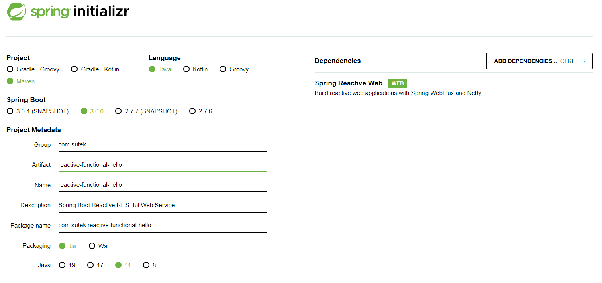
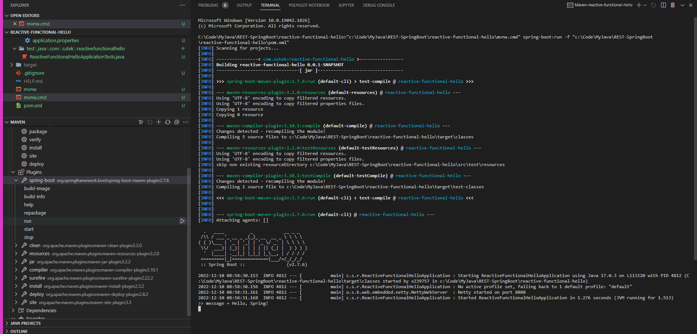
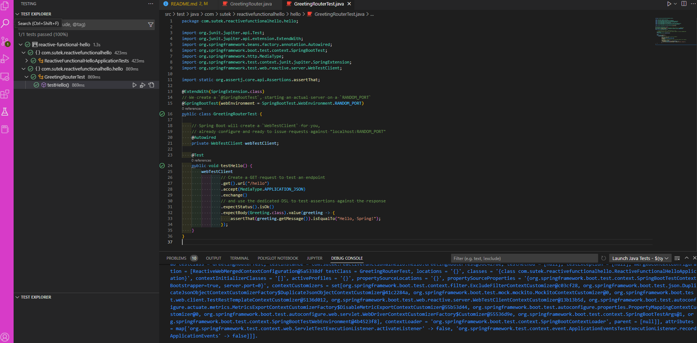
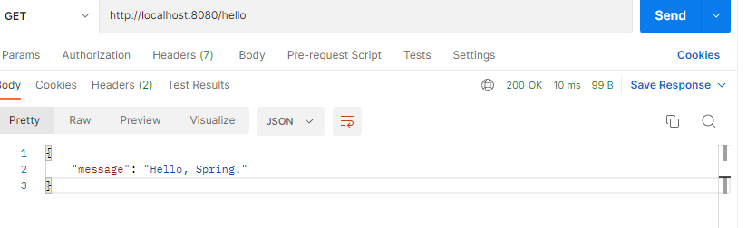

# Building a Reactive RESTful Web Service with Spring Boot

## Starting with Spring Initializr



### Load into IDE

IntelliJ has some issues on the maven plugin.

VSCode works fine - need to make sure JDK settings are correct.


```dos
c:\>java -version
openjdk version "17.0.3" 2022-04-19 LTS
OpenJDK Runtime Environment Microsoft-32931 (build 17.0.3+7-LTS)
OpenJDK 64-Bit Server VM Microsoft-32931 (build 17.0.3+7-LTS, mixed mode, sharing)
```

## Create a WebFlux Handler

Greeting.java

## Create a Router

GreetingRouter.java

VSCode can't auto-import the following:

```java
import static org.springframework.web.reactive.function.server.RequestPredicates.GET;
import static org.springframework.web.reactive.function.server.RequestPredicates.accept;
```

## Create a WebClient

GreetingClient.java

## Make the Application Executable

## Build an executable JAR

`mvnw spring-boot:run`

`java -jar target/reactive-functional-hello-0.0.1-SNAPSHOT.jar`



`mvnw spring-boot:start`

## Unit test

...

## Test the Application (integration Test)

GreetingRouterTest.java



## Integration Test with Postman


