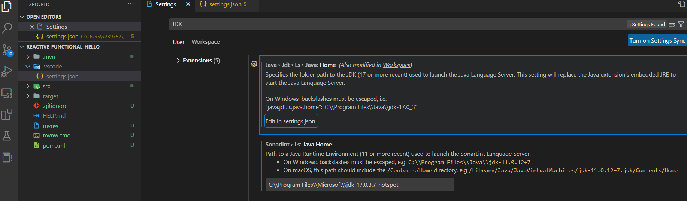

# Building a Reactive RESTful Web Service with Spring Boot

## Starting with Spring Initializr


### Load into IDE

IntelliJ has some issues on the maven plugin.

VSCode works fine - need to make sure JDK settings are correct.



```dos
c:\>java -version
openjdk version "17.0.3" 2022-04-19 LTS
OpenJDK Runtime Environment Microsoft-32931 (build 17.0.3+7-LTS)
OpenJDK 64-Bit Server VM Microsoft-32931 (build 17.0.3+7-LTS, mixed mode, sharing)
```

## Create a WebFlux Handler

Greeting.java

## Create a Router

GreetingRouter.java

## Create a WebClient

GreetingClient.java

## Make the Application Executable

## Build an executable JAR

mvnw spring-boot:run

java -jar target/gs-reactive-rest-service-0.1.0.jar


## Test the Application

GreetingRouterTest.java

## Integration Test with Postman


