# Spring Boot, Spring Security, JWT, Access Tokens, Refresh Tokens

## User Service

### Knowledge Points

<details>
  <summary>Click to expand!</summary>

```java
	@Override
	protected void configure(HttpSecurity http) throws Exception {
		//change the default /login to /api/login
		CustomAuthenticationFilter customAuthenticationFilter =
			new CustomAuthenticationFilter(authenticationManagerBean());
		customAuthenticationFilter.setFilterProcessesUrl("/api/login");

		http.csrf().disable();
		http.sessionManagement().sessionCreationPolicy(SessionCreationPolicy.STATELESS);
		http.authorizeRequests().antMatchers("/api/login/**", "/api/token/refresh/**").permitAll();
		http.authorizeRequests().antMatchers(String.valueOf(FormSubmitEvent.MethodType.GET), "/api/user/**").hasAnyAuthority("ROLE_USER");
		http.authorizeRequests().antMatchers(String.valueOf(FormSubmitEvent.MethodType.POST), "/api/user/save/**").hasAnyAuthority("ROLE_ADMIN");
		http.authorizeRequests().anyRequest().authenticated();
		http.addFilter(customAuthenticationFilter);
		http.addFilterBefore(new CustomAuthorizationFilter(), UsernamePasswordAuthenticationFilter.class);
	}
```

```java
	@Override
	protected void successfulAuthentication(HttpServletRequest request, HttpServletResponse response,
	                                        FilterChain chain, Authentication authentication) throws IOException, ServletException {
		User user = (User) authentication.getPrincipal();

		Algorithm algorithm = Algorithm.HMAC256("secret".getBytes());

		String access_token = JWT.create()
			.withSubject(user.getUsername())
			.withExpiresAt(new Date(System.currentTimeMillis() + 10 * 60 * 1000))
			.withIssuer(request.getRequestURL().toString())
			.withClaim("roles", user.getAuthorities().stream().map(GrantedAuthority::getAuthority).collect(Collectors.toList()))
			.sign(algorithm);

		String refresh_token = JWT.create()
			.withSubject(user.getUsername())
			.withExpiresAt(new Date(System.currentTimeMillis() + 30 * 60 * 1000))
			.withIssuer(request.getRequestURL().toString())
			.sign(algorithm);

		Map<String, String> tokens = new HashMap<>();
		tokens.put("access_token", access_token);
		tokens.put("refresh_token", refresh_token);
		response.setContentType(MediaType.APPLICATION_JSON_VALUE);
		new ObjectMapper().writeValue(response.getOutputStream(), tokens);
	}
```

```java
    @Override
	protected void doFilterInternal(HttpServletRequest request, HttpServletResponse response, FilterChain filterChain) throws ServletException, IOException {
		if (request.getServletPath().equals("/api/login") || request.getServletPath().equals("/api/token/refresh")) {
			filterChain.doFilter(request, response);
		} else {
			String authorizationHeader = request.getHeader(AUTHORIZATION);
			if (authorizationHeader != null && authorizationHeader.startsWith("Bearer ")) {
				try {
					String token = authorizationHeader.substring("Bearer ".length());
					Algorithm algorithm = Algorithm.HMAC256("secret".getBytes());
					JWTVerifier verifier = JWT.require(algorithm).build();
					DecodedJWT decodedJWT = verifier.verify(token);
					String username = decodedJWT.getSubject();
					String[] roles = decodedJWT.getClaim("roles").asArray(String.class);
					Collection<SimpleGrantedAuthority> authorities = new ArrayList<>();
					Arrays.stream(roles).forEach(role -> {
						authorities.add(new SimpleGrantedAuthority(role));
					});
					UsernamePasswordAuthenticationToken authenticationToken =
						new UsernamePasswordAuthenticationToken(username, null, authorities);
					SecurityContextHolder.getContext().setAuthentication(authenticationToken);
					log.info("Logged in successfully: {}", username);
					filterChain.doFilter(request, response);
				} catch (Exception e) {
					log.error("Error logging in: {}", e.getMessage());
					response.setHeader("error", e.getMessage());
					response.setStatus(FORBIDDEN.value());
					Map<String, String> error = new HashMap<>();
					error.put("error_message", e.getMessage());
					response.setContentType(MediaType.APPLICATION_JSON_VALUE);
					new ObjectMapper().writeValue(response.getOutputStream(), error);
				}
			} else {
				filterChain.doFilter(request, response);
			}
		}
	}
```

```java
	@GetMapping("/token/refresh")
	public void refreshToken(HttpServletRequest request, HttpServletResponse response) throws IOException {
		String authorizationHeader = request.getHeader(AUTHORIZATION);
		if (authorizationHeader != null && authorizationHeader.startsWith("Bearer ")) {
			try {
				String refresh_token = authorizationHeader.substring("Bearer ".length());
				Algorithm algorithm = Algorithm.HMAC256("secret".getBytes());
				JWTVerifier verifier = JWT.require(algorithm).build();
				DecodedJWT decodedJWT = verifier.verify(refresh_token);
				String username = decodedJWT.getSubject();
				User user = userService.getUser(username);

				String access_token = JWT.create()
					.withSubject(user.getUsername())
					.withExpiresAt(new Date(System.currentTimeMillis() + 10 * 60 * 1000))
					.withIssuer(request.getRequestURL().toString())
					.withClaim("roles",
						user.getRoles().stream().map(Role::getName).collect(Collectors.toList()))
					.sign(algorithm);

				Map<String, String> tokens = new HashMap<>();
				tokens.put("access_token", access_token);
				tokens.put("refresh_token", refresh_token);
				response.setContentType(MediaType.APPLICATION_JSON_VALUE);
				new ObjectMapper().writeValue(response.getOutputStream(), tokens);

				log.info("Token refreshed");
			} catch (Exception e) {
				response.setHeader("error", e.getMessage());
				response.setStatus(FORBIDDEN.value());
				Map<String, String> error = new HashMap<>();
				error.put("error_message", e.getMessage());
				response.setContentType(MediaType.APPLICATION_JSON_VALUE);
				new ObjectMapper().writeValue(response.getOutputStream(), error);
			}
		} else {
			throw new RuntimeException("Refresh token is missing");
		}
	}
```

</details>

### Screenshot

<details>
  <summary>Click to expand!</summary>

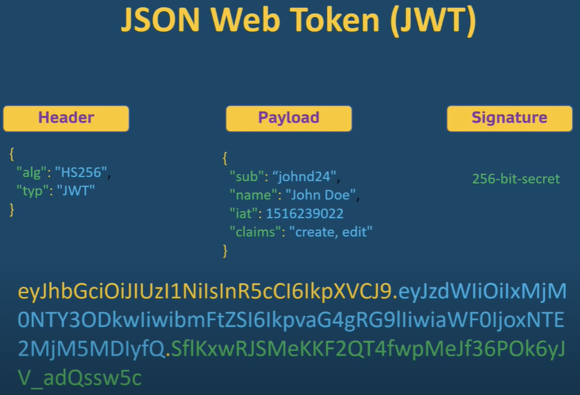

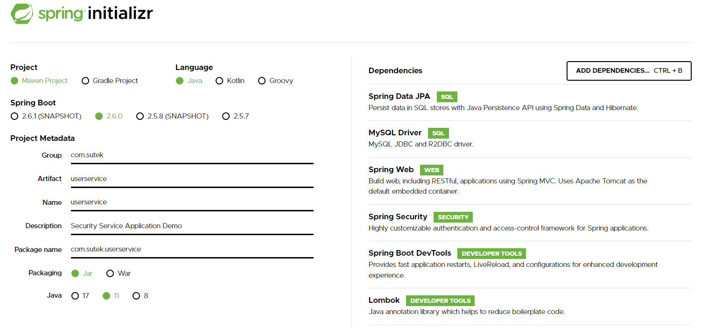

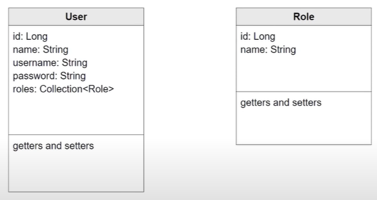

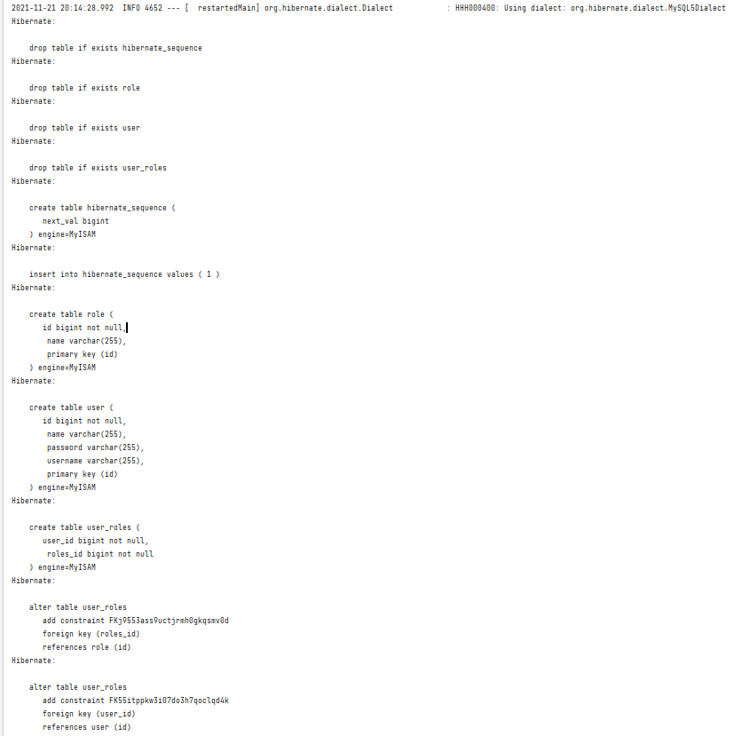

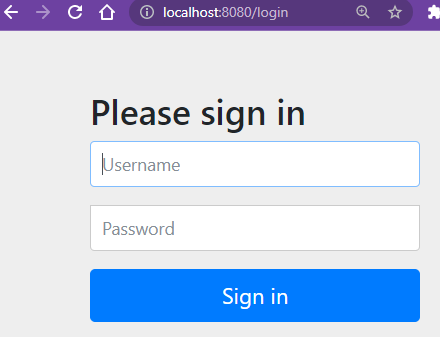

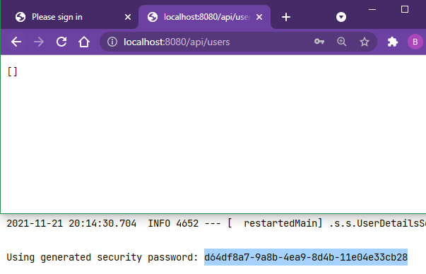

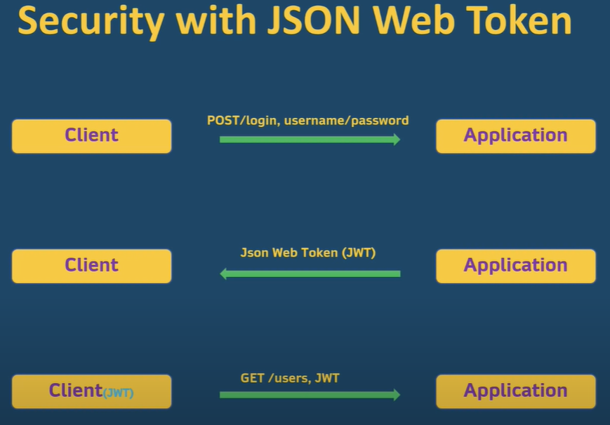

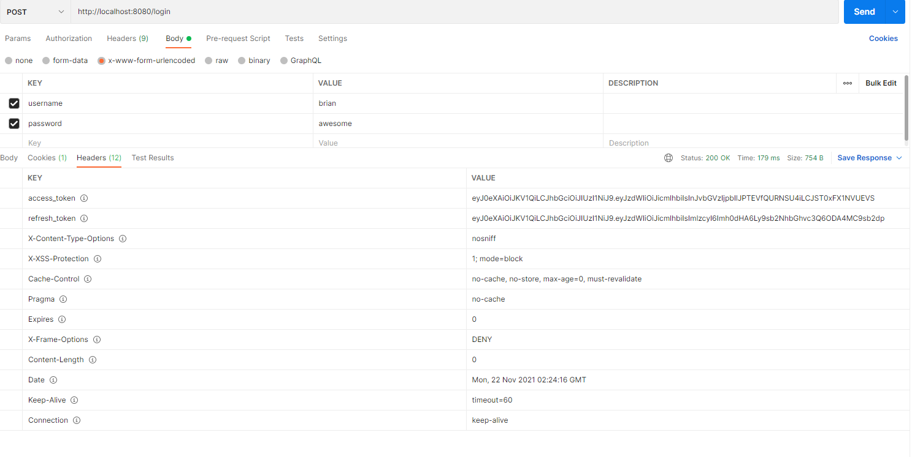

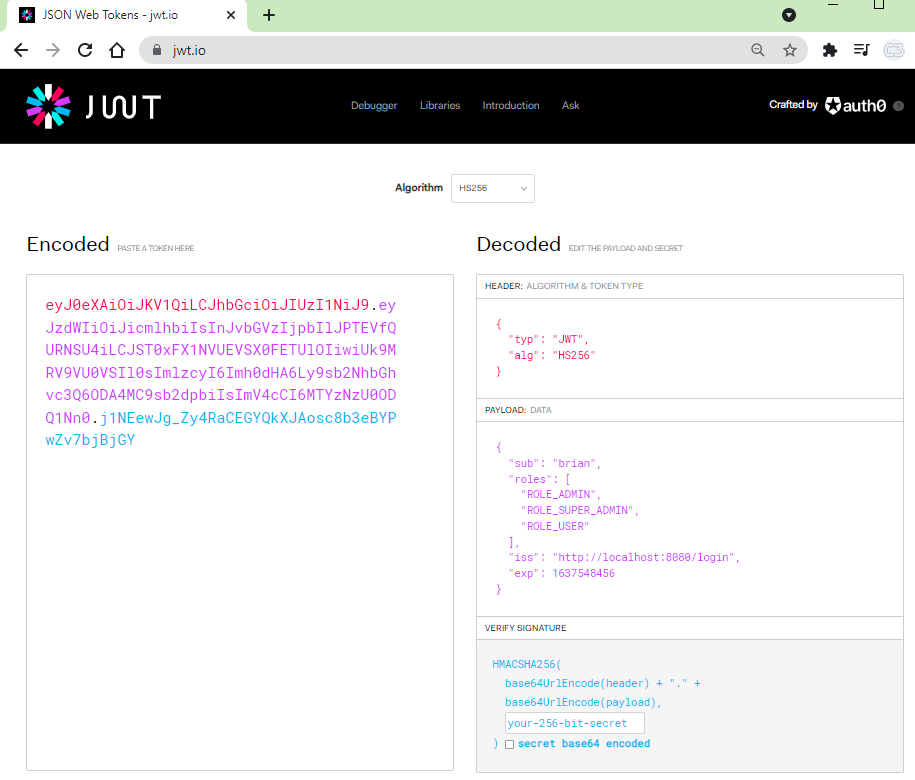

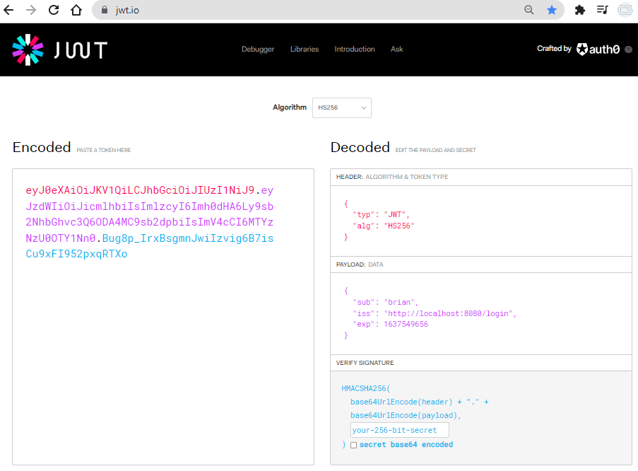

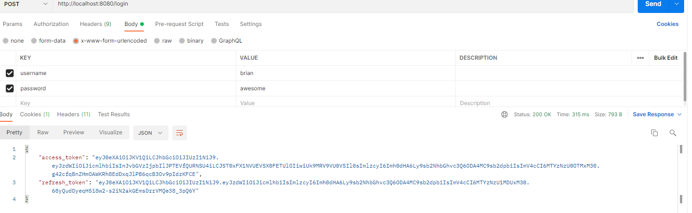

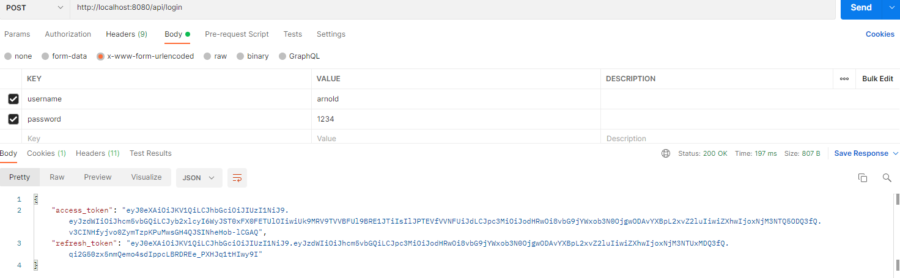

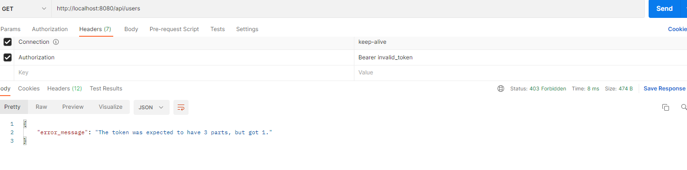

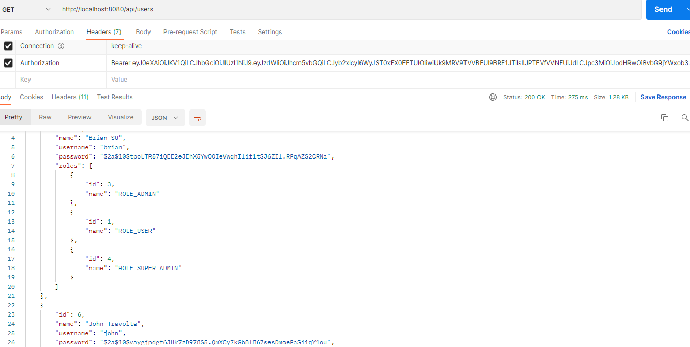

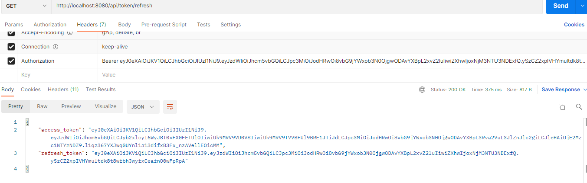


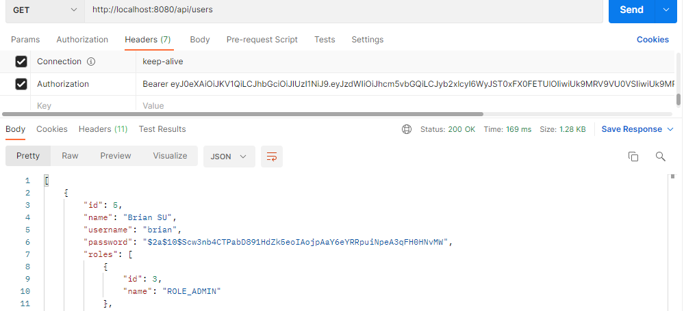

</details>
