# My Skills Inventory

## Info

In business disruption, a skills inventory can help align company goals with employee performance.

### What is a Skills Inventory?

A skills inventory is the collection of skills, education, and experiences of employees. Skills inventories capture the professional expertise, attributes, and abilities of your workforce. A centralized skills inventory provides a point-in-time view of the skills (and skills gaps) of a workforce. But the inventory should be a dynamic system, regularly updated to reflect changes in team members, skills, and professional credentials.

## Swagger

```
?
```

### Prefix

/api/v1/skill-inventory/

### Operations

#### GET /skills

Get all skills

i.e.
GET http://localhost:8080/api/v1/skill-inventory/skills

#### GET /skill/{id}

Get one skill by Id

i.e.
GET http://localhost:8080/api/v1/skill-inventory/skills/1

#### GET /skill?keyword=$keyword

Find one or more skills by keyword

i.e.
GET http://localhost:8080/api/v1/skill-inventory/skills?keyword=cloud

#### POST

Add a new skill

i.e.
POST http://localhost:8080/api/v1/skill-inventory/skills

```json
{
  "skillName": "AWS",
  "skillNameLong": "Amazon Web Services",
  "skillDescription": "AWS Cloud",
  "skillStatus": 1,
  "skillPriority": 1
}
```

```json
{
  "skillName": "GCP",
  "skillNameLong": "Google Cloud Platform",
  "skillDescription": "Google Cloud",
  "skillStatus": 1,
  "skillPriority": 1
}
```

```json
{
  "skillName": "Java",
  "skillNameLong": "Java Programming Language",
  "skillDescription": "Java",
  "skillStatus": 1,
  "skillPriority": 1
}
```

```json
{
  "skillName": "Angular",
  "skillNameLong": "Angular",
  "skillDescription": "Full Stack; Javascript",
  "skillStatus": 1,
  "skillPriority": 1
}
```

```json
{
  "skillName": "Oracle",
  "skillNameLong": "Oracle",
  "skillDescription": "Oracle RDBMS",
  "skillStatus": 1,
  "skillPriority": 1
}
```

#### PUT /skill/{id}

Update one skill by Id (completely)

i.e.
PUT http://localhost:8080/api/v1/skill-inventory/skills/2

```json
{
  "skillId": 2,
  "skillName": "GCP",
  "skillNameLong": "Google Cloud Platform",
  "skillDescription": "Google Cloud",
  "skillStatus": 1,
  "skillPriority": 1
}
```

->

```
{
    "skillName": "Kafka",
    "skillNameLong": "Kafka",
    "skillDescription": "Kafka messaging",
    "skillStatus": 1,
    "skillPriority": 1
}
```

#### PATCH /skill/{id}

Partially update one skill by Id

i.e.
PATCH http://localhost:8080/api/v1/skill-inventory/skills/3

```
{
    "skillName": "Kafka",
    "skillNameLong": "Kafka",
    "skillDescription": "Kafka messaging",
    "skillStatus": 1,
    "skillPriority": 1
}
```

->

```
{
    "skillName": "Redis",
    "skillPriority": "2"
}
```

->

```
{
    "skillName": "Redis",
    "skillNameLong": "Redis",
    "skillDescription": "Redis DB",
    "skillStatus": 1,
    "skillPriority": 2
}
```

#### DELETE /skill/{id}

Delete a skill

i.e.
DELETE http://localhost:8080/api/v1/skill-inventory/skills/4

```
{
    "skillName": "Angular",
    "skillNameLong": "Angular",
    "skillDescription": "Full Stack; Javascript",
    "skillStatus": 1,
    "skillPriority": 1
}
```

## Tech stacks

### Back end

```
Java
    JDK 17
    Spring Boot
    JPA
    Lombok
    json-patch
    ObjectMapper
MySQL

```

```
<dependency>
    <groupId>com.github.java-json-tools</groupId>
    <artifactId>json-patch</artifactId>
    <version>1.13</version>
</dependency>
```

```
<dependency>
    <groupId>com.fasterxml.jackson.core</groupId>
    <artifactId>jackson-core</artifactId>
    <version>2.12.5</version>
</dependency>
<dependency>
    <groupId>com.fasterxml.jackson.core</groupId>
    <artifactId>jackson-annotations</artifactId>
    <version>2.12.5</version>
</dependency>
<dependency>
    <groupId>com.fasterxml.jackson.core</groupId>
    <artifactId>jackson-databind</artifactId>
    <version>2.12.5</version>
</dependency>
```

### Front end

```
?
```

## Troubleshooting

### consumes = "application/json-patch+json"

It is needed in the controller classes.

### Dependencies

jackson-core and jackson-annotations are needed for jackson-databind.

## Misc

### Changing Spring Boot banners

```
Use "Spring Boot banner Generator" to create a file named banner.txt in the src/main/resources

```

```
spring.banner.location=classpath:/path/to/banner/sutek_banner.txt
```

```
spring.banner.image.location=classpath:sutek_banner.gif
spring.banner.image.width=  //TODO
spring.banner.image.height= //TODO
spring.banner.image.margin= //TODO
spring.banner.image.invert= //TODO
```

```
 ▄▄▄▄▄▄▄▄▄▄   ▄▄▄▄▄▄▄▄▄▄▄  ▄▄▄▄▄▄▄▄▄▄▄  ▄▄▄▄▄▄▄▄▄▄▄  ▄▄        ▄       ▄▄▄▄▄▄▄▄▄▄▄  ▄         ▄
▐░░░░░░░░░░▌ ▐░░░░░░░░░░░▌▐░░░░░░░░░░░▌▐░░░░░░░░░░░▌▐░░▌      ▐░▌     ▐░░░░░░░░░░░▌▐░▌       ▐░▌
▐░█▀▀▀▀▀▀▀█░▌▐░█▀▀▀▀▀▀▀█░▌ ▀▀▀▀█░█▀▀▀▀ ▐░█▀▀▀▀▀▀▀█░▌▐░▌░▌     ▐░▌     ▐░█▀▀▀▀▀▀▀▀▀ ▐░▌       ▐░▌
▐░▌       ▐░▌▐░▌       ▐░▌     ▐░▌     ▐░▌       ▐░▌▐░▌▐░▌    ▐░▌     ▐░▌          ▐░▌       ▐░▌
▐░█▄▄▄▄▄▄▄█░▌▐░█▄▄▄▄▄▄▄█░▌     ▐░▌     ▐░█▄▄▄▄▄▄▄█░▌▐░▌ ▐░▌   ▐░▌     ▐░█▄▄▄▄▄▄▄▄▄ ▐░▌       ▐░▌
▐░░░░░░░░░░▌ ▐░░░░░░░░░░░▌     ▐░▌     ▐░░░░░░░░░░░▌▐░▌  ▐░▌  ▐░▌     ▐░░░░░░░░░░░▌▐░▌       ▐░▌
▐░█▀▀▀▀▀▀▀█░▌▐░█▀▀▀▀█░█▀▀      ▐░▌     ▐░█▀▀▀▀▀▀▀█░▌▐░▌   ▐░▌ ▐░▌      ▀▀▀▀▀▀▀▀▀█░▌▐░▌       ▐░▌
▐░▌       ▐░▌▐░▌     ▐░▌       ▐░▌     ▐░▌       ▐░▌▐░▌    ▐░▌▐░▌               ▐░▌▐░▌       ▐░▌
▐░█▄▄▄▄▄▄▄█░▌▐░▌      ▐░▌  ▄▄▄▄█░█▄▄▄▄ ▐░▌       ▐░▌▐░▌     ▐░▐░▌      ▄▄▄▄▄▄▄▄▄█░▌▐░█▄▄▄▄▄▄▄█░▌
▐░░░░░░░░░░▌ ▐░▌       ▐░▌▐░░░░░░░░░░░▌▐░▌       ▐░▌▐░▌      ▐░░▌     ▐░░░░░░░░░░░▌▐░░░░░░░░░░░▌
 ▀▀▀▀▀▀▀▀▀▀   ▀         ▀  ▀▀▀▀▀▀▀▀▀▀▀  ▀         ▀  ▀        ▀▀       ▀▀▀▀▀▀▀▀▀▀▀  ▀▀▀▀▀▀▀▀▀▀▀

```

## Screenshot

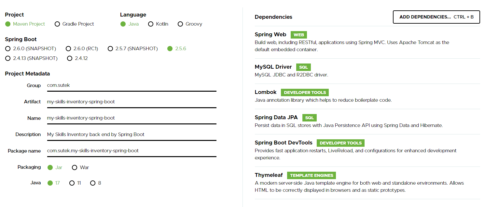
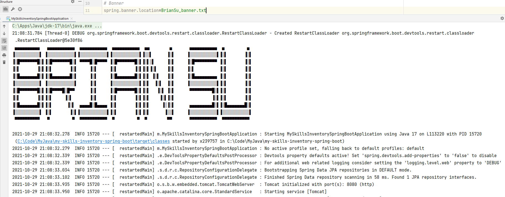
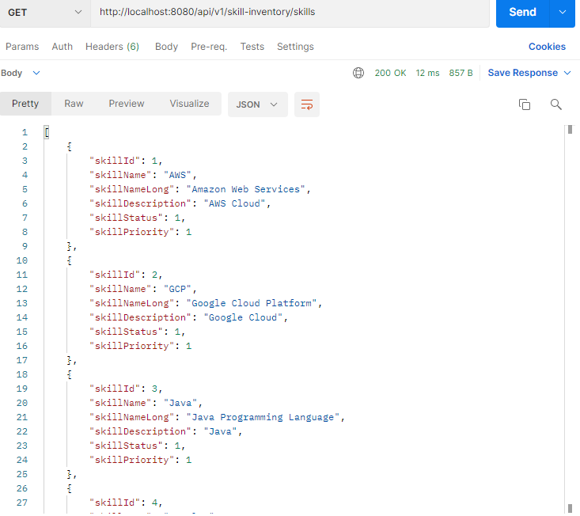
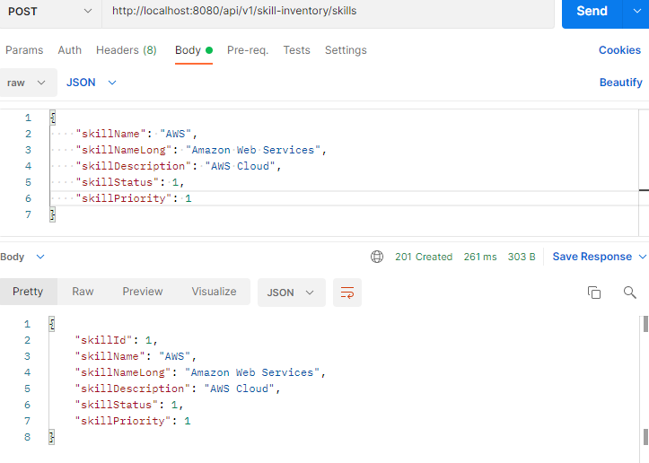
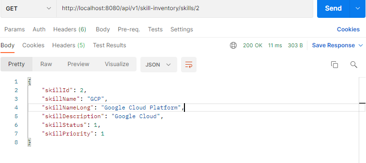
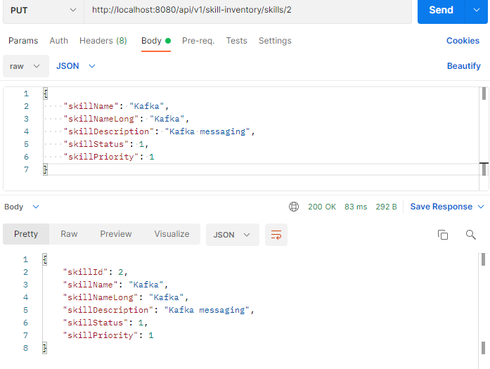
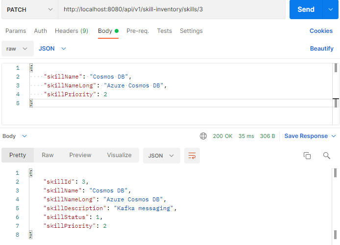
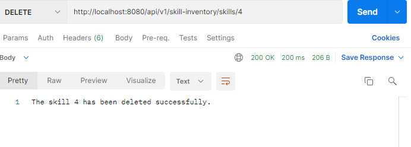
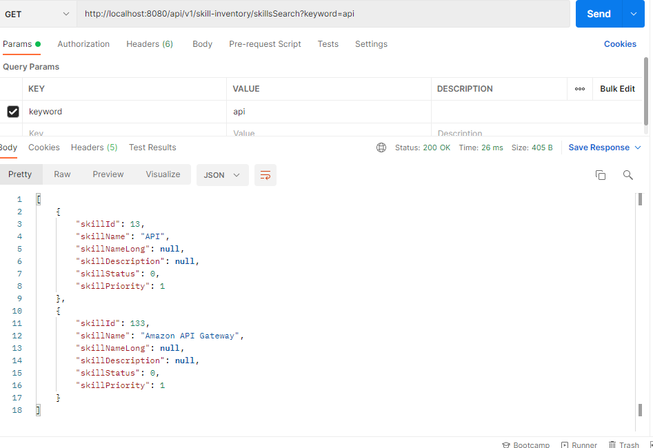


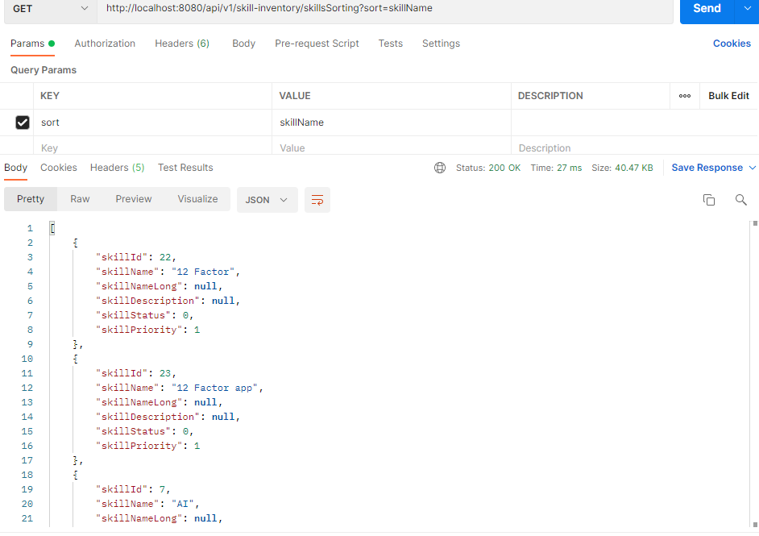
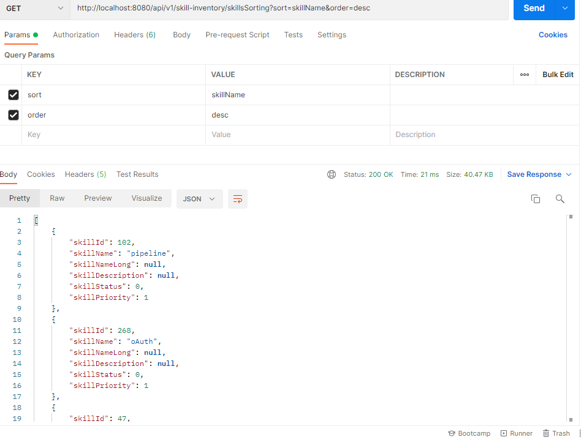
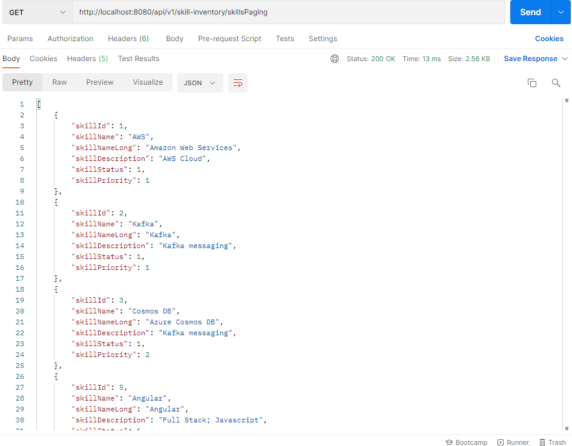

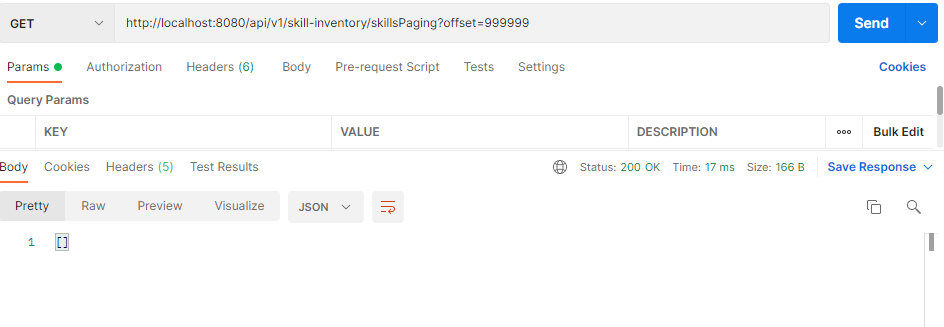
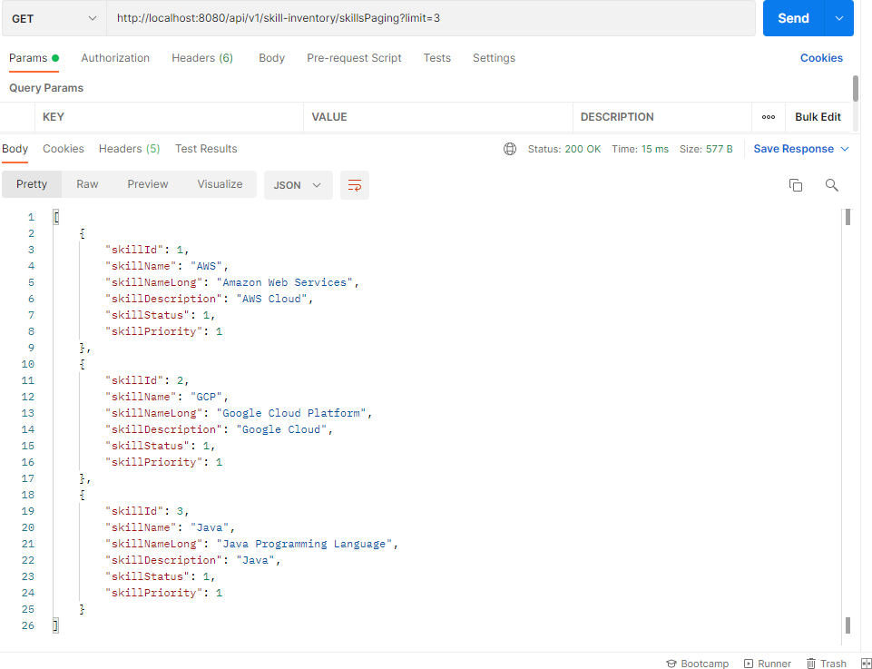
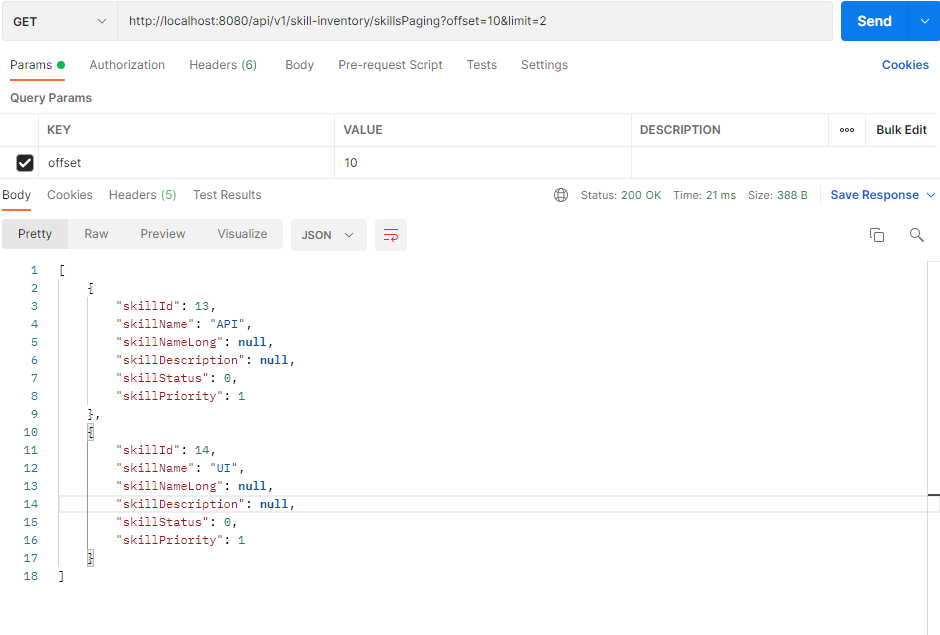
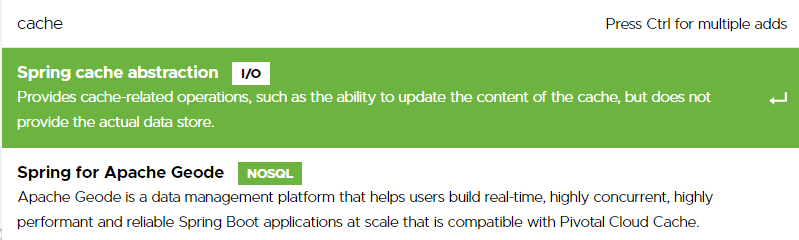
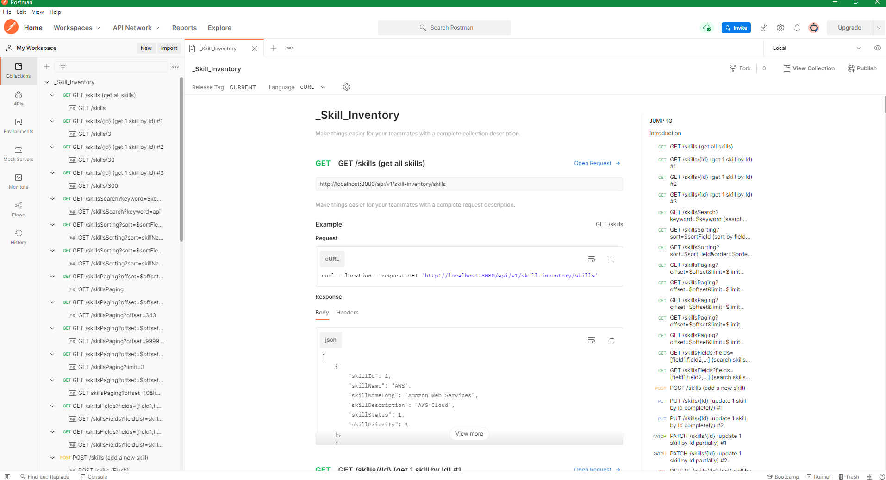
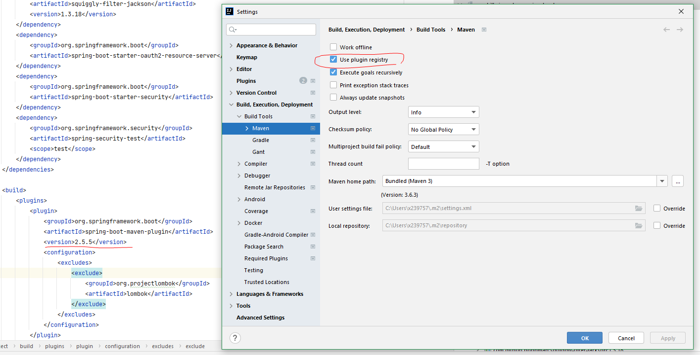
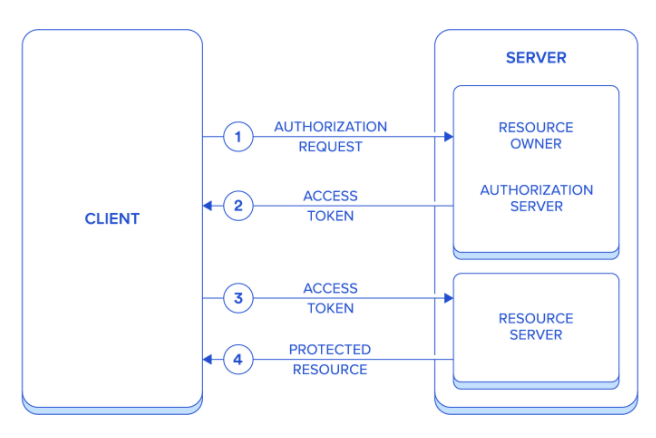
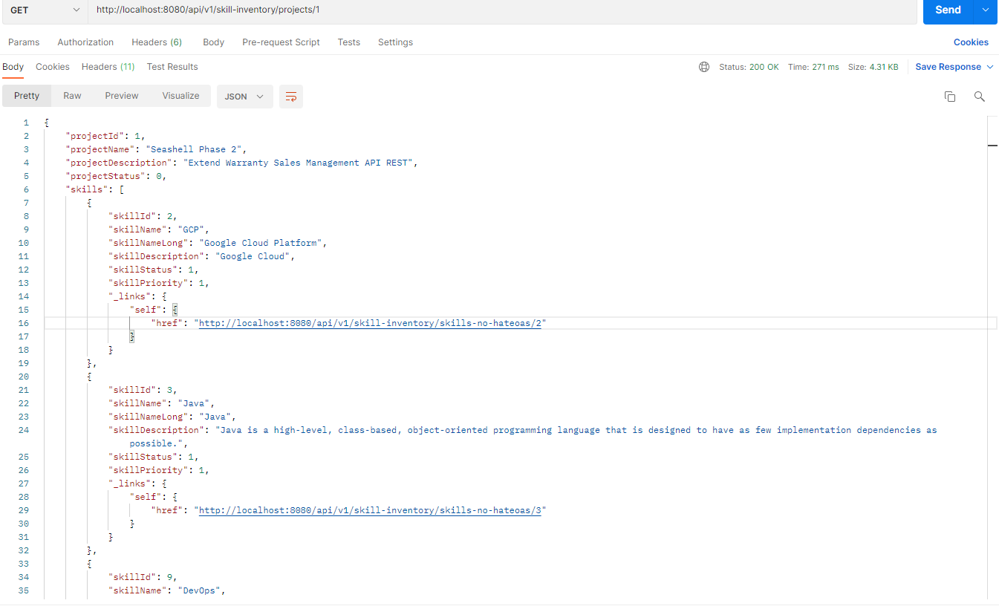
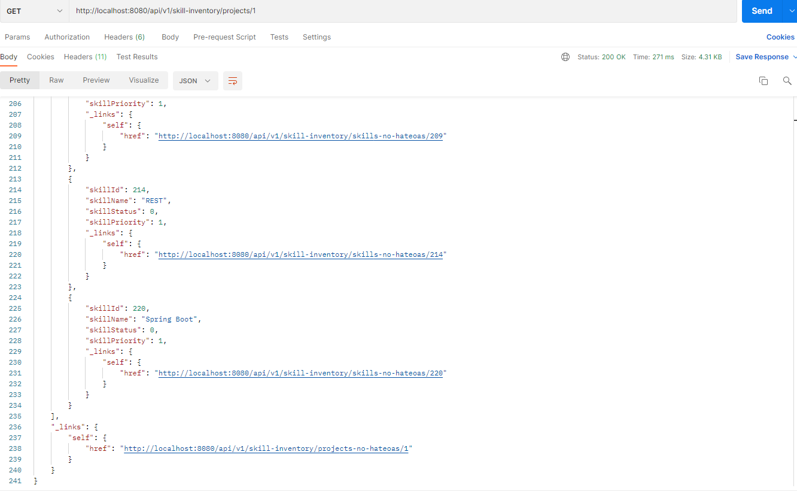


