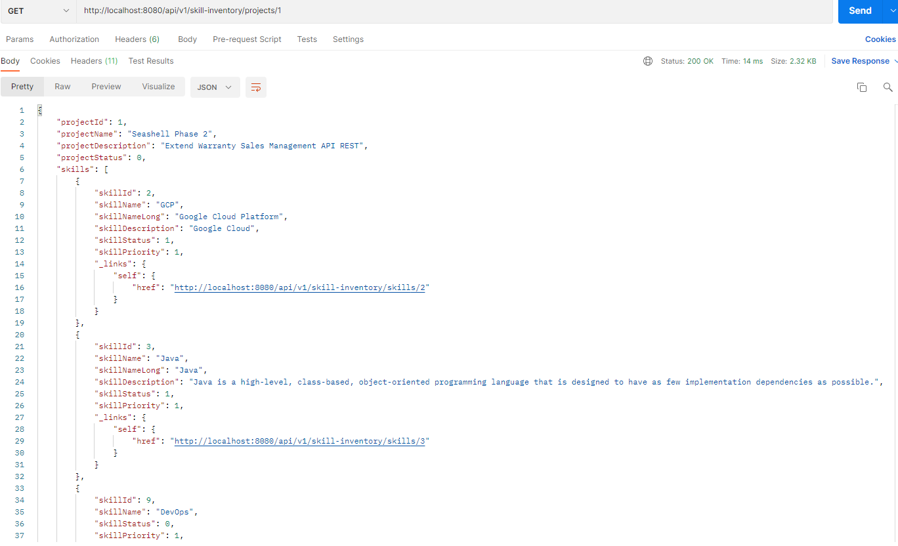

# My Skills Inventory

## Info

In business disruption, a skills inventory can help align company goals with employee performance.

### What is a Skills Inventory?

A skills inventory is the collection of skills, education, and experiences of employees. Skills inventories capture the professional expertise, attributes, and abilities of your workforce. A centralized skills inventory provides a point-in-time view of the skills (and skills gaps) of a workforce. But the inventory should be a dynamic system, regularly updated to reflect changes in team members, skills, and professional credentials.

## API Specification / Documentation

### OpenAPI Swagger

http://editor.swagger.io

v3 or v2
YAML or JSON

```yaml
openapi: 3.0.0

info:
  version: 0.0.1
  title: Library Service
  description: The library service

tags:
  - name: "Library"

paths:
  /library/books:
    get:
      summary: This is summary
      tags:
        - "Library"
      description: This is a description
      operationId: getAllBooksInLibrary
      responses:
        "200":
          description: This means its ok
          content:
            application/json:
              schema:
                type: array
                items:
                  $ref: "#/components/schemas/Book"

components:
  schemas:
    Book:
      description: This is the book model
      type: object
      properties:
        name:
          description: The name of book
          type: string
        bookAuthor:
          description: name of author
          type: string
```

### Prefix

/api/v1/skill-inventory/

### TMF?

?

### Operations

#### POST /login

Login -> authenticate and authorization.

i.e.
POST http://localhost:8080/api/v1/login

Provide these in the headers:

- client ID or username
- client secret or password

Get these from the results:

- access_token
- refresh_token

#### GET /token/refresh

Refresh the token.

i.e.
GET http://localhost:8080/api/v1/token/refresh

#### GET /skills

Get all skills.

i.e.
GET http://localhost:8080/api/v1/skill-inventory/skills

#### GET /skills/{id}

Get one skill by Id.

i.e.
GET http://localhost:8080/api/v1/skill-inventory/skills/1

(Updated)

http://localhost:8080/api/v1/skill-inventory/skills/3:

```json
{
  "skillId": 3,
  "skillName": "Java",
  "skillNameLong": "Java Programming Language",
  "skillDescription": "Java",
  "skillStatus": 1,
  "skillPriority": 1
}
```

->

http://localhost:8080/api/v1/skill-inventory/skills/3:

```json
{
  "skillId": 3,
  "skillName": "Java",
  "skillNameLong": "Java Programming Language",
  "skillDescription": "Java",
  "skillStatus": 1,
  "skillPriority": 1,
  "projects": [
    {
      "_self": "http://localhost:8080/api/v1/skill-inventory/skills/3/projects/1",
      "name": "Seashell Phase 2"
    },
    {
      "_self": "http://localhost:8080/api/v1/skill-inventory/skills/3/projects/2",
      "name": "CPIN"
    }
  ]
}
```

and

http://localhost:8080/api/v1/skill-inventory/skills/3/projects/1:

```json
{
  "projectId": 1,
  "projectName": "Seashell Phase 2",
  "projectDescription": "Extend Warranty Sales Management API REST",
  "projectStatus": 0
}
```

#### GET /skillsSearch?keyword=$keyword

Searching/Filtering skills by keyword.

i.e.
GET http://localhost:8080/api/v1/skill-inventory/skillsSearch?keyword=cloud

#### Get all skills with sorting

Get all skills with sorting.

i.e.
GET http://localhost:8080/api/v1/skill-inventory/skillsSorting?sort=skillName
GET http://localhost:8080/api/v1/skill-inventory/skillsSorting?sort=skillName&order=desc

#### Get all skills with pagination and offset

Get all skills with pagination and offset.

The default values are limit=20 and offset=0.

i.e.
GET http://localhost:8080/api/v1/skill-inventory/skillsPaging
GET http://localhost:8080/api/v1/skill-inventory/skillsPaging?offset=20
GET http://localhost:8080/api/v1/skill-inventory/skillsPaging?limit=3
GET http://localhost:8080/api/v1/skill-inventory/skillsPaging?offset=10&limit=5

#### GET /skillsFields?fields=[field1,field2,...]

Get all skills with field selection.

i.e.
GET http://localhost:8080/api/v1/skill-inventory/skillsFields?fieldList=skillName,skillPriority
GET http://localhost:8080/api/v1/skill-inventory/skillsFields?fieldList=skillId,skillNameLong,skillStatus

Use : or . for sub-object fields.

i.e.
GET http://localhost:8080/api/v1/skill-inventory/skillsFields?fields=name,priority,project.client,project.info

Note:
GraphQL does better job on this.

#### POST

Add a new skill.

i.e.
POST http://localhost:8080/api/v1/skill-inventory/skills

```json
{
  "skillName": "AWS",
  "skillNameLong": "Amazon Web Services",
  "skillDescription": "AWS Cloud",
  "skillStatus": 1,
  "skillPriority": 1
}
```

```json
{
  "skillName": "GCP",
  "skillNameLong": "Google Cloud Platform",
  "skillDescription": "Google Cloud",
  "skillStatus": 1,
  "skillPriority": 1
}
```

```json
{
  "skillName": "Java",
  "skillNameLong": "Java Programming Language",
  "skillDescription": "Java",
  "skillStatus": 1,
  "skillPriority": 1
}
```

```json
{
  "skillName": "Angular",
  "skillNameLong": "Angular",
  "skillDescription": "Full Stack; Javascript",
  "skillStatus": 1,
  "skillPriority": 1
}
```

```json
{
  "skillName": "Oracle",
  "skillNameLong": "Oracle",
  "skillDescription": "Oracle RDBMS",
  "skillStatus": 1,
  "skillPriority": 1
}
```

#### PUT /skills/{id}

Update one skill by Id (completely).

i.e.
PUT http://localhost:8080/api/v1/skill-inventory/skills/2

```json
{
  "skillId": 2,
  "skillName": "GCP",
  "skillNameLong": "Google Cloud Platform",
  "skillDescription": "Google Cloud",
  "skillStatus": 1,
  "skillPriority": 1
}
```

->

```json
{
  "skillName": "Kafka",
  "skillNameLong": "Kafka",
  "skillDescription": "Kafka messaging",
  "skillStatus": 1,
  "skillPriority": 1
}
```

#### PATCH /skills/{id}

Update one skill by Id (partially).

i.e.
PATCH http://localhost:8080/api/v1/skill-inventory/skills/3

```json
{
  "skillName": "Kafka",
  "skillNameLong": "Kafka",
  "skillDescription": "Kafka messaging",
  "skillStatus": 1,
  "skillPriority": 1
}
```

->

```json
{
  "skillName": "Redis",
  "skillPriority": "2"
}
```

->

```json
{
  "skillName": "Redis",
  "skillNameLong": "Redis",
  "skillDescription": "Redis DB",
  "skillStatus": 1,
  "skillPriority": 2
}
```

#### DELETE /skills/{id}

Delete a skill by Id.

i.e.
DELETE http://localhost:8080/api/v1/skill-inventory/skills/4

```json
{
  "skillName": "Angular",
  "skillNameLong": "Angular",
  "skillDescription": "Full Stack; Javascript",
  "skillStatus": 1,
  "skillPriority": 1
}
```

#### GET /projects

Get all projects.

i.e.
GET http://localhost:8080/api/v1/skill-inventory/projects

#### GET /projects/{id}

Get one project by Id.

i.e.
GET http://localhost:8080/api/v1/skill-inventory/projects/1

### Postman collection

?

## Tech stacks

### Back end

```
Java
  JDK 17
  Spring Boot
  JPA
  Lombok
  Spring cache abstraction
  json-patch
  ObjectMapper
REST
MySQL
```

```xml
<dependency>
	<groupId>org.springframework.boot</groupId>
	<artifactId>spring-boot-starter-cache</artifactId>
  <version>2.5.0</version>
</dependency>
```

There is another module named spring-context-support, which sits on top of the spring-context module and provides a few more CacheManagers backed by the likes of EhCache or Caffeine.

Since the spring-context-support module transitively depends on the spring-context module, there is no need for a separate dependency declaration for the spring-context.

```xml
<dependency>
  <groupId>org.springframework</groupId>
  <artifactId>spring-context-support</artifactId>
  <version>5.3.3</version>
</dependency>
```

```xml
<dependency>
  <groupId>javax.cache</groupId>
  <artifactId>cache-api</artifactId>
</dependency>

<dependency>
  <groupId>org.ehcache</groupId>
  <artifactId>ehcache</artifactId>
  <version>3.9.6</version>
</dependency>
```

```xml
<dependency>
  <groupId>com.github.java-json-tools</groupId>
  <artifactId>json-patch</artifactId>
  <version>1.13</version>
</dependency>
```

```xml
<dependency>
  <groupId>com.fasterxml.jackson.core</groupId>
  <artifactId>jackson-core</artifactId>
  <version>2.12.5</version>
</dependency>
<dependency>
  <groupId>com.fasterxml.jackson.core</groupId>
  <artifactId>jackson-annotations</artifactId>
  <version>2.12.5</version>
</dependency>
<dependency>
  <groupId>com.fasterxml.jackson.core</groupId>
  <artifactId>jackson-databind</artifactId>
  <version>2.12.5</version>
</dependency>
```

```xml
<dependency>
  <groupId>com.github.bohnman</groupId>
  <artifactId>squiggly-filter-jackson</artifactId>
  <version>1.3.18</version>
</dependency>
```

```xml
<dependencies>
  <dependency>
      <groupId>org.springframework.boot</groupId>
      <artifactId>spring-boot-starter-web</artifactId>
  </dependency>
  <dependency>
      <groupId>io.swagger</groupId>
      <artifactId>swagger-annotations</artifactId>
      <version>1.5.21</version>
  </dependency>
  <dependency>
      <groupId>io.swagger</groupId>
      <artifactId>swagger-models</artifactId>
      <version>1.6.0</version>
  </dependency>
  <dependency>
      <groupId>com.fasterxml.jackson.core</groupId>
      <artifactId>jackson-annotations</artifactId>
      <version>2.10.3</version>
  </dependency>
  <dependency>
      <groupId>javax.validation</groupId>
      <artifactId>validation-api</artifactId>
  </dependency>
</dependencies>

<build>
  <plugins>
      <plugin>
          <groupId>io.swagger.codegen.v3</groupId>
          <artifactId>swagger-codegen-maven-plugin</artifactId>
          <version>3.0.18</version>
          <executions>
              <execution>
                  <goals>
                      <goal>generate</goal>
                  </goals>
                  <configuration>
                      <inputSpec>${project.basedir}/src/main/resources/test-api.yaml</inputSpec>
                      <language>spring</language>
                      <output>${project.build.directory}/generated-sources/</output>
                      <generateSupportingFiles>false</generateSupportingFiles>
                      <apiPackage>com.example.api</apiPackage>
                      <modelPackage>com.example.models</modelPackage>
                      <configOptions>
                          <interfaceOnly>true</interfaceOnly>
                      </configOptions>
                  </configuration>
              </execution>
          </executions>
      </plugin>
  </plugins>
</build>
```

### Front end

```
?
```

## Design

### Data Modeling

Category
Keyword
Years
Relationship
Projects (href)
Wiki URL
GitHub URL

### Dependencies

### TMF

#### TMF 630

##### TMF 630 REST API Design Guidelines

TMF630 v4.0.1 (May, 2020)

- Part 1 : RESTful API naming, CRUD, filtering, notifications
- Part 2 : Polymorphism, extension patterns, depth and expand directive, entity RefOrValue
- Part 3 : Hypermedia support extension
- Part 4 : Lifecycle management and common tasks (export and import jobs)
- Part 5 : JSON Patch extension to manage arrays
- Part 6 : JSON Path extension
- Part 7 : JSON Schema patterns

##### TMF 630 Minimum Conformance Checklist

- Documentation is provided in Swagger/OAS 2.0

- URL is formatted correctly, including naming and versioning

- Routing uses resource/task-based paths

- HTTP verbs are used to select action against a resource

- Response uses appropriate HTTP status codes

- Response header contains details about the response body

- Response body is a resource/task presented using JSON

- Error responses utilize the Error resource as the response body

- If this is a TMF Open API, any mandatory fields in the entity exist

- If this is a TMF Open API, any customizations must utilize the TMF extension pattern

- If this is a TMF Open API, the Conformance Test Kit must be run and must pass

##### TMF 630 Minimum Compliance Requirement

- URL query string can be used by the consumer to modify the response content

  - Select (FIELDS)
  - Sort (SORT)
  - Match criteria
  - Page (LIMIT,OFFSET)
  - Detail (DEPTH,EXPAND)

- Hypermedia links to other relevant resources are provided in responses

- The /home path provides a JSON-LD Hypermedia summary of available functions

- Event subscription is enabled via the Hub

- If any resources have versions, they utilize the TMF version format

- If any operations are asynchronous, they utilize the TMF monitor pattern

##### TMF620 Product Catalog Management

- Swagger (Apache 2.0 or RAND)
- API User Guide Specification (RAND)
- Conformance Profile (RAND)
- CTK
- Sample Implementation Code
- Postman Collection

##### TMF637 Product Inventory

### API Naming Conventions

REST Resource Naming Guide

### CRUD

### value vs path

Value is an alias to Path.

### PUT vs PATCH

#### How to implement PATCH

Using JsonPatch or not?

Too much boilerplate and troubles if using JsonPatch.

### Caching

#### How to implement Caching

(1) Dependencies

Spring cache abstraction

(2) @Cacheable("skills")

(3) @EnableCaching

#### Addtional caching choices

- Redis
  Redis is an in-memory key-value data structure store that can be used as a database, cache, and message broker.

```xml
<dependency>
  <groupId>org.springframework.boot</groupId>
  <artifactId>spring-boot-starter-data-redis</artifactId>
  <version>2.5.0</version>
</dependency>
```

- Caffeine
  Caffeine is a high-performance, near-optimal caching library providing an in-memory cache using a Google Guava inspired API.

```xml
<dependency>
  <groupId>com.github.ben-manes.caffeine</groupId>
  <artifactId>caffeine</artifactId>
  <version>3.0.2</version>
</dependency>
```

- Couchbase
  Couchbase is a distributed NoSQL cloud database that also offers a fully integrated caching layer, providing high-speed data access.

```xml
<dependency>
  <groupId>com.couchbase.client</groupId>
  <artifactId>java-client</artifactId>
  <version>3.1.5</version>
</dependency>
```

### Searching / Filtering

GET /skillsSearch?keyword=data

#### How to implement searching / filteringn?

Two ways -

##### Using Java 8 Steam API (Recommended)

Stream.filter()

##### Using @Query

Containing
findByFirstnameContaining
… where x.firstname like ?1 (parameter bound wrapped in %)

### Sorting

GET /skillsSorting?sort=skillName&order=desc

GET /skillsSorting?sort=skillPriority&order=desc

GET /skillsSorting?sort=skillNameLong

The default should be sort=None and order=asc.

Another design approach is:

GET /skillsSorting?sort=+priority,-status

#### How to implement sorting?

Two ways -

##### Using Java 8 Steam API (Recommended)

Comparator.comparing(...)

##### Using @Query

...

### Pagination and offset

GET /skillsPaging
GET /skillsPaging?offset=10
GET /skillsPaging?limit=5
GET /skillsPaging?offset=10&limit=5

The default values are limit=20 and offset=0.

#### How to implement Pagination and offset?

Two ways -

##### Using Java 8 Steam API (Recommended)

skip + limit

##### Using @Query

...

### Field selection

GET /skillsFields?fields=name,priority

#### How to implement field selection?

Too much work!

(1) Model

```java
@JsonFilter("fieldFilter")
```

(2) Controller

```java
SimpleFilterProvider filterProvider = new SimpleFilterProvider().addFilter("fieldFilter",
  SimpleBeanPropertyFilter.filterOutAllExcept(fieldList.split(",")));
ObjectMapper mapper = new ObjectMapper().setFilterProvider(filterProvider);
```

(3) Filter!

Unhappy workaround:

- Create a "duplicated" model class (@Data @Entity)
- Add the filter (@JsonFilter)
- Create a "duplicated" JpaRepository for the "new" model (@Repository)
- Use the filter in the Controller

The original model doesn't use the filter.

#### Solution

Replace with GraphQL.

### Validation

### Error handling (ControllerAdvice)

### Duplicates / Overwritten

### Abbreviation and Variation

### Performance / Caching

Retrieve all skills from DB and cache them.

Any POST/PUT/PATCH/DELETE will invert the cache.

### Security

#### How to implement the security

With Spring Security,h JWT including Access and Refresh Tokens!

The API callers need to login first - provide the client ID and client secret (or username + password)
then use generated tokens (access_token + refresh_token) to access APIs.

Encoded tokens can be decoded at jwt.io :-)

#### Spring Security

```xml
<dependency>
  <groupId>org.springframework.boot</groupId>
  <artifactId>spring-boot-starter-security</artifactId>
</dependency>
<dependency>
  <groupId>org.springframework.security</groupId>
  <artifactId>spring-security-test</artifactId>
  <scope>test</scope>
</dependency>
```

### oAuth 2, JWT

- Authorization Server (AS)
  Simply put, an Authorization Server is an application that issues tokens for authorization.

  Previously, the Spring Security OAuth stack offered the possibility of setting up an Authorization Server as a Spring Application. But the project has been deprecated, mainly because OAuth is an open standard with many well-established providers such as Okta, Keycloak, and ForgeRock etc.

  Keycloak. It's an open-source Identity and Access Management server administered by Red Hat, developed in Java, by JBoss. It supports not only OAuth2 but also other standard protocols such as OpenID Connect and SAML.

  oauth-authorization-server is a Keycloak Authorization Server wrapped as a Spring Boot application.

  There is one OAuth Client registered in the Authorization Server:
  Client Id: newClient
  Client secret: newClientSecret
  Redirect Uri: http://localhost:8089/

- Resource Server (RS)

```xml
<dependency>
  <groupId>org.springframework.boot</groupId>
  <artifactId>spring-boot-starter-oauth2-resource-server</artifactId>
</dependency>
```

oauth-resource-server is a Spring Boot based RESTFul API, acting as a backend Application.

```yml
server:
  port: 8081
  servlet:
    context-path: /resource-server

spring:
  security:
    oauth2:
      resourceserver:
        jwt:
          issuer-uri: http://localhost:8083/auth/realms/baeldung
          jwk-set-uri: http://localhost:8083/auth/realms/baeldung/protocol/openid-connect/certs
```

The jwk-set-uri property points to the URI containing the public key so that our Resource Server can verify the tokens' integrity.

The issuer-uri property represents an additional security measure to validate the issuer of the tokens (which is the Authorization Server). However, adding this property also mandates that the Authorization Server should be running before we can start the Resource Server application.

#### Spring Profile

#### API key

#### Rate limit

### CORS

### Use sub-resources for relations

### HATEOAS

Hypermedia as the Engine of Application State is a principle that hypertext links should be used to create a better navigation through the API.

```json
{
  "id": 888,
  "manufacturer": "bmw",
  "model": "X3",
  "seats": 5,
  "drivers": [
    {
      "id": "48",
      "name": "Brian Su",
      "links": [
        {
          "rel": "self",
          "href": "/api/v1/drivers/48"
        }
      ]
    }
  ]
}
```

#### How to implement HATEOAS

Hypermedia-Driven RESTful!

(1) Dependencies:

- Spring HATEOAS

```xml
<dependency>
    <groupId>org.springframework.boot</groupId>
    <artifactId>spring-boot-starter-hateoas</artifactId>
</dependency>
```

- JSON Library

```xml
<dependency>
  <groupId>com.jayway.jsonpath</groupId>
  <artifactId>json-path</artifactId>
  <scope>test</scope>
</dependency>
```

(2) Configure JPA entities and repositories

```java
@ManyToMany(cascade=CascadeType.ALL)
@JoinTable(
  name = "project_skill",
  joinColumns = @JoinColumn(name = "project_id"),
  inverseJoinColumns = @JoinColumn(name = "skill_id"))
```

(3) Create a Resource Representation Class

DTO?

Extend the domain class with RepresentationModel

Create Representation model assemblers

(4) Create a REST Controller

Create instances of this class

Populate the properties and enrich it with links

(5) Test the Service

### Version

### Unit Testing

### Automation Testing

### DevOps CI/CD

### Angular app UI

### React app UI

### Upgrade to GraphQL

### Neo4j

### Docker

### Paas / OpenShift

### Cloud Native

## Troubleshooting

### Dependencies

jackson-core and jackson-annotations are needed for jackson-databind.

### StringUtils.isEmpty() -> ObjectUtils.isEmpty()

StringUtils.isEmpty() has been deprecated and should be replaced by ObjectUtils.isEmpty().

### @EnableJpaRepositories(repositoryBaseClass = ExtendedRepositoryImpl.class)

### Lombok and JPA???

Entity looks better!
But it doesn't work well :-(
Using @Data for JPA entities is not recommended. It can cause severe performance and memory consumption issues.

### Change log

### Spring Boot NoClassFound error

- Remove all files from .m2 folder
- Maven refresh
- Maven clean
- Maven install
- Re-run Spring Boot

## Misc

### consumes = "application/json-patch+json"

It is needed in the controller classes.

### @JsonCreator @JsonProperty

### Changing Spring Boot banners

```
Use "Spring Boot banner Generator" to create a file named banner.txt in the src/main/resources

```

```
spring.banner.location=classpath:/path/to/banner/sutek_banner.txt
```

```
spring.banner.image.location=classpath:sutek_banner.gif
spring.banner.image.width=  //TODO
spring.banner.image.height= //TODO
spring.banner.image.margin= //TODO
spring.banner.image.invert= //TODO
```

```
 ▄▄▄▄▄▄▄▄▄▄   ▄▄▄▄▄▄▄▄▄▄▄  ▄▄▄▄▄▄▄▄▄▄▄  ▄▄▄▄▄▄▄▄▄▄▄  ▄▄        ▄       ▄▄▄▄▄▄▄▄▄▄▄  ▄         ▄
▐░░░░░░░░░░▌ ▐░░░░░░░░░░░▌▐░░░░░░░░░░░▌▐░░░░░░░░░░░▌▐░░▌      ▐░▌     ▐░░░░░░░░░░░▌▐░▌       ▐░▌
▐░█▀▀▀▀▀▀▀█░▌▐░█▀▀▀▀▀▀▀█░▌ ▀▀▀▀█░█▀▀▀▀ ▐░█▀▀▀▀▀▀▀█░▌▐░▌░▌     ▐░▌     ▐░█▀▀▀▀▀▀▀▀▀ ▐░▌       ▐░▌
▐░▌       ▐░▌▐░▌       ▐░▌     ▐░▌     ▐░▌       ▐░▌▐░▌▐░▌    ▐░▌     ▐░▌          ▐░▌       ▐░▌
▐░█▄▄▄▄▄▄▄█░▌▐░█▄▄▄▄▄▄▄█░▌     ▐░▌     ▐░█▄▄▄▄▄▄▄█░▌▐░▌ ▐░▌   ▐░▌     ▐░█▄▄▄▄▄▄▄▄▄ ▐░▌       ▐░▌
▐░░░░░░░░░░▌ ▐░░░░░░░░░░░▌     ▐░▌     ▐░░░░░░░░░░░▌▐░▌  ▐░▌  ▐░▌     ▐░░░░░░░░░░░▌▐░▌       ▐░▌
▐░█▀▀▀▀▀▀▀█░▌▐░█▀▀▀▀█░█▀▀      ▐░▌     ▐░█▀▀▀▀▀▀▀█░▌▐░▌   ▐░▌ ▐░▌      ▀▀▀▀▀▀▀▀▀█░▌▐░▌       ▐░▌
▐░▌       ▐░▌▐░▌     ▐░▌       ▐░▌     ▐░▌       ▐░▌▐░▌    ▐░▌▐░▌               ▐░▌▐░▌       ▐░▌
▐░█▄▄▄▄▄▄▄█░▌▐░▌      ▐░▌  ▄▄▄▄█░█▄▄▄▄ ▐░▌       ▐░▌▐░▌     ▐░▐░▌      ▄▄▄▄▄▄▄▄▄█░▌▐░█▄▄▄▄▄▄▄█░▌
▐░░░░░░░░░░▌ ▐░▌       ▐░▌▐░░░░░░░░░░░▌▐░▌       ▐░▌▐░▌      ▐░░▌     ▐░░░░░░░░░░░▌▐░░░░░░░░░░░▌
 ▀▀▀▀▀▀▀▀▀▀   ▀         ▀  ▀▀▀▀▀▀▀▀▀▀▀  ▀         ▀  ▀        ▀▀       ▀▀▀▀▀▀▀▀▀▀▀  ▀▀▀▀▀▀▀▀▀▀▀

```

### Ports

- 8080: API
- 8081: Resource Server
- 8083: Authorization Server
- 8089: Redirect URI

## Skills

```
Full Stack
DevOps
Data
Cloud
Mobile

API
UI
Microservice

Pattern
Design Pattern
Twelve-Factor
Twelve-Factor App
Twelve-Factor methodology
Twelve-Factor App methodology
12 Factor
12 Factor app
Cloud Native

Java
Python
Go
Golang
Kotlin
Javascript
Node.js
C#
Shell Script
TypeScript
Scala
Ruby
Erlang
Object-C
Swift
PHP

Angular
React
VUE
Material
Material UI
Bootstrap
jQuery

Agile
Scrum
SDLC
ITSM
ITIL

Government
Banking
Financial Services
Insurance
Energy
Telecom
Telecommunications
Healthcare
Pharmaceutical
Postal Service
Consulting
IT
Software
Oil & Gas
Petroleum
Retail

Google
Amazon
Microsoft
Salesforce
Oracle
IBM
RedHat
SAP
VMWare
HP
Accenture
Capgemini
Express Scripts
RBC
BMO
NBC
Manulife
Sunlife
CMHC
Canada Post
Hydro One
Husky Energy
Rogers
Telus
Loblaws

OPS
Ontario Public Service
Government of Canada
Federal Government
Ontario Ministry of Children, Community and Social Services
Ontario Ministry of Health and Long-Term Care
Ontario Ministry of Education

CI/CD
pipeline

HTML
HTML 5
CSS
CSS 3
CSS media

Docker
Kubernetes
Container
Containerization orchestration

Terraform
Jenkins
Ansible

AWS
Amazon Web Service
GCP
Google Cloud
Google Cloud Platform
Azure
Snowflake
Heroku
Salesforce Cloud
Pivotal Cloud Foundry
PCF
Tanzu
IBM Cloud
SAP Cloud
SAP Cloud Platform

Cloud Computing
Cloud Storage
Serverless Computing

Amazon API Gateway
Amazon RDS
Amazon Aurora
Amazon Lambda
Amazon EC2
Amazon VPC
Amazon Route 53
Amazon S3
Amazon CloudFront
Amazon IAM
Amazon Cognito
Amazon SNS
Amazon SQS
Amazon Redshift
Amazon Kinesis
Amazon Elastic Search

Google Cloud App Engine
gcloud CLI
Google Cloud SDK
GKE
Google Kubernetes Engine
Cloud Pub/Sub
Stackdriver
Cloud Run
Anthos
Bigtable
Firestore
Memorystore
Spanner
Cloud Dataflow
Cloud Dataproc
Cloud Dataprep
Cloud Datalab
Cloud Source Repositories
Cloud Scheduler
Container Registry
Apache Beam
Istio

Azure Cognitive Services
Azure Compute
Azure Functions
Azure Blob storage
Azure cFile storage
Azure Active Directory
Azure Key Vault
Azure Analytics
Azure AI
Azure Kubernetes Service
Azure Container Registry
Azure DevOps
Azure Pipelines
Azure Repos
Azure Test Plans

Public Cloud
Private Cloud
Hybrid Cloud

AI
Machine Learning
TensorFlow

IoT
Internet of things

Jupyter Notebook

SQL
PLSQL
TSQL

NoSQL
DynamoDB
Big Query
Cosmos DB
MongoDB
RDBMS
MySQL
PostgreSQL
Oracle
MS SQL Server
DB2

OpenShift
Cloud Foundry

PaaS
IaaS
SaaS

REST
GraphQL
gRPC
SOAP
SOA
Web Services

Spring Boot
Spring
DI
Dependency Injection
IoC
Inversion of Control
AOP
Autowired
Spring MVC
Spring Data

Django
Django REST

Kafka
RabbitMQ
Redis
JMS

Git
GitHub
GitLab

YAML
JSON
XML

Shopify

SPA

Expo
Apple
Andriod

IBM InfoSphere
IBM WebSphere
IBM DataStage and QualityStage
IBM Cognos
Informatica PowerCenter
Informatica Developer

Big Data
ETL
Data Integration
Data Quality
Data Warehouse
Data Analytics
Data Ingestion
Data Governance
Data Migration
Data Visualization
MDM
Master Data Management
Data Lake

SSIS
SSAS

oAuth
OIDC
OpenID Connect
JWT
JSON Web Token
SAML
OAS
Swagger

TDD
BDD
Mock
WireMock
SOLID

TLS
SSL

TCP/IP
HTTP

Unix
Linux
Windows

Bourne shell (sh)
Korn shell (ksh)
Bourne Again shell (bash)
POSIX shell (sh)

C Shell (csh)
TENEX/TOPS C shell (tcsh)

Ubuntu
Debian
Centos

AODA
WCAG
Screen reader
HiSoftware Compliance Sheriff
WAVE toolbar
Colour Contrast Check

JIRA
Confluence

WebLogic
Oracle WebLogic
RedHat WildFly
RedHat JBoss
Tomcat

QC
HP QC
Quality Center
ALM
HP ALM
Application Lifecycle Management

JDBC
ODBC

PowerShell
DOS

C
C++
Visual Basic .Net

EJB
JSP
Servlet
Struts
Apache Struts 2
Hibernate
JUnit

SVN
ASP
CGI

Perl
Basic
Fortran
Pascal
Delphi
COBOL
J#
F#
DHTML
Borland C++
ActionScript

DBA
System Admin
Unix Admin

AIX
Solaris
```

## Screenshot





## Change log

2021-10-29

- Came up the business idea
- Did the brainstorming
- Completed the basic design
- Finalized the tech stacks
- Set up the DB
- Initialized with Spring initializer
- Created the Spring Boot project
- Finished the basic CRUD operations

2021-10-30

- Published the 1st version to GitHub
- Updated the README.md
- Finished the initial data load
- Added lots of more TODO features
- Worked on advanced API developments (i.e. field selection, sorting etc.)
- API design pattern and best practice
- Streaming API vs DB queries
- Lombok vs JPA

2021-10-31

- Published the 2nd version to GitHub
- Updated the README.md
- Updated more TODO features
- Worked on advanced API developments (i.e. caching, paging etc.)
- Started security features
- oAuth, JWT tokens, Spring Security

2021-11-01

- Published the 3rd version to GitHub
- Updated the README.md
- Updated data model (added more tables with relationship)
- Updated GET operations to include project information with HATEOAS

2021-11-02

- TMF
- TMF630
- README.md

2021-11-03

- README.md
- Swagger YAML

2021-11-04

- README.md
- Fixed HATEOAS issue
- The full list of TMF Open APIs
- ...

2021-11-05

- README.md
- ...

2021-11-06

- README.md
- ...

## Appendix

### TMF

- TMF666 Account Management API
- TMF651 Agreement Management API
- TMF915 AI Management API Component Suite
- TMF642 Alarm Management API
- TMF646 Appointment API
- TMF681 Communication API
- TMF678 Customer Bill Management API
- TMF629 Customer Management API
- TMF662 Entity Catalog Management API
- TMF710 General Test Artifact Management API
- TMF704 General Test Artifact Management API
- TMF673 Geographic Address Management API
- TMF674 Geographic Site Management API
- TMF668 Partnership Type Management API
- TMF683 Party Interaction Management API
- TMF632 Party Management API
- TMF669 Party Role Management API
- TMF676 Payment Management API
- TMF654 Prepay Balance Management API
- TMF644 Privacy Management API
- TMF620 Product Catalog Management API
- TMF637 Product Inventory Management API
- TMF679 Product Offering Qualification API
- TMF622 Product Ordering API
- TMF671 Promotion API
- TMF648 Quote Management API
- TMF634 Resource Catalog Management API
- TMF639 Resource Inventory Management API
- TMF652 Resource Ordering Management API
- TMF696 Risk Management API
- TMF699 Sales Management API
- TMF640 Service Activation and Configuration API
- TMF633 Service Catalog API
- TMF638 Service Inventory Management API
- TMF641 Service Ordering Management API
- TMF656 Service Problem Management
- TMF645 Service Qualification API
- TMF657 Service Quality Management API
- TMF653 Service Test Management API
- TMF663 Shopping Cart API
- TMF687 Stock Management API
- TMF706 Test Data Management API
- TMF705 Test Environment Management API
- TMF708 Test Execution Management API
- TMF707 Test Result Management API
- TMF709 Test Scenario Management API
- TMF621 Trouble Ticket API
- TMF677 Usage Consumption Management API
- TMF635 Usage Management API
- TMF672 User Roles & Permissions API

### HTTP status codes

```
200 – OK – Eyerything is working
201 – OK – New resource has been created
204 – OK – The resource was successfully deleted
304 – Not Modified – The client can use cached data
400 – Bad Request – The request was invalid or cannot be served. The exact error should be explained in the error payload. E.g. "The JSON is not valid"
401 – Unauthorized – The request requires an user authentication
403 – Forbidden – The server understood the request, but is refusing it or the access is not allowed.
404 – Not found – There is no resource behind the URI.
422 – Unprocessable Entity – Should be used if the server cannot process the enitity, e.g. if an image cannot be formatted or mandatory fields are missing in the payload.
500 – Internal Server Error – API developers should avoid this error. If an error occurs in the global catch blog, the stracktrace should be logged and not returned as response.
```

### HTTP headers

- Accepts
- Content-Type
  values:
  application/json
  application/xml
  Accept-Language
  Content-Language
- Accept-Language
- Content-Language
  values:
  en_GB
  fr_CA
- Content-Length
- ETag
- Last-Modified
- Location
- X-Total-Count
- Cache-Control
- Expires
- Date
- X-Rate-Limit-Limit
- X-Rate-Limit-Remaining
- X-Rate-Limit-Reset
- Accept-Range:items
- Range:items=i-j
- Content-Range:items i-j/n

### Java Annotations

@Override
@Deprecated
@SpringBootApplication
@Entity // Makes this class to be a JPA entity
@Getter // Creates setters for all the fields in the class
@Setter // Creates getters for all the fields in the class
@Builder // Creates a builder pattern for this class
@NoArgsConstructor // Creates a constructor with no arguements for this class
@AllArgsConstructor // Creates a constructor with all arguements for this class
@Id // Marks the Id as the primary key
@GeneratedValue(strategy = GenerationType.AUTO) //@GeneratedValue(strategy = GenerationType.IDENTITY)
@Column(name = "id", nullable = false)
@Column(name = "skill_name", nullable = false)
@NotNull
@ManyToOne
@OneToMany(targetEntity = Project.class, mappedBy = "project", fetch = FetchType.LAZY, cascade = CascadeType.ALL)
@ManyToMany(fetch = EAGER)
@JoinColumn(name = "project_id")
@Data
@Table(name = "skill")
@JsonFilter("fieldFilter")
@Repository
@CacheConfig(cacheNames={"skills"})
@Cacheable("skills")
@Cacheable({"skills", "projects"})
@Cacheable(cacheNames = "skills")
@Cacheable(cacheNames = "skill", key = "#id")
@CachePut(value = "skills", key = "#skill.skillId")
@CachePut(value = "skill", key = "#skillId")
@EnableCaching
@Configuration
@Bean
@Component
@Service
@Autowired
@RestController
@RequestMapping("/api/v1/skill-inventory")
@GetMapping(value = "skillsPaging")
@RequestParam(name = "order", required = false)
@PostMapping(value = "skills")
@PutMapping(value = "skills/{id}")
@PatchMapping(value = "skills/{id}")
@DeleteMapping(value = "skills/{id}")
@ResponseStatus(value = HttpStatus.OK)
@AuthenticationPrincipal
@CrossOrigin(origins = "http://localhost:8089")
@Validated
@PreAuthorize
@PostAuthorize
@Slf4j
@Transactional
@RequiredArgsConstructor
@EnableWebSecurity
@JsonCreator
@JsonProperty
@JsonRootName(value = "skill")
@Relation(collectionRelation = "projects")
@JsonInclude(Include.NON_NULL)
@EqualsAndHashCode(callSuper = false)
@ToString(exclude = "clients")
