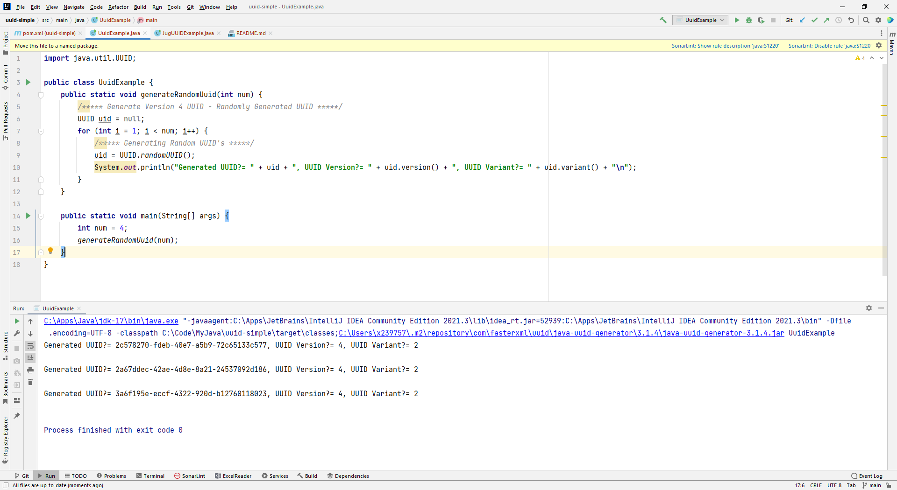
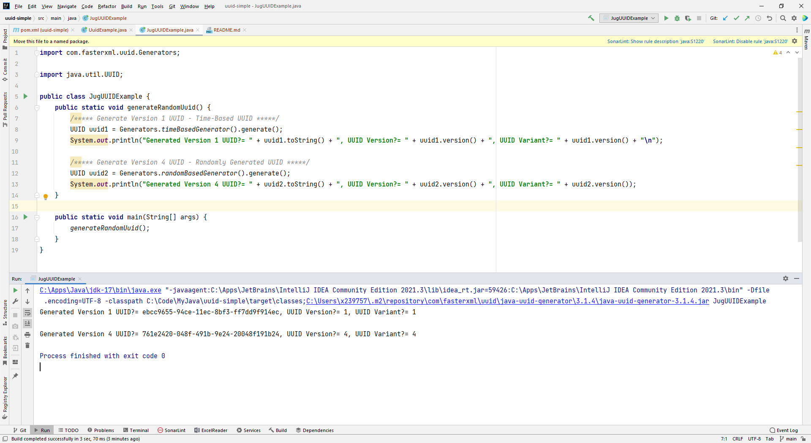
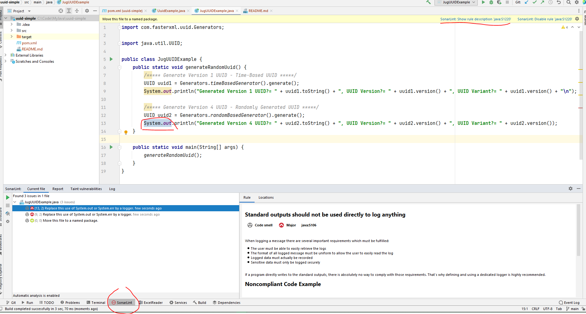

# Java UUID Simple

## POM.xml

```xml
    <dependencies>
        <dependency>
            <groupId>com.fasterxml.uuid</groupId>
            <artifactId>java-uuid-generator</artifactId>
            <version>3.1.4</version>
        </dependency>
    </dependencies>
    <build>
        <finalName>${project.artifactId}</finalName>
    </build>
```

## Screenshot





## Java UUID Generator (JUG)

https://github.com/cowtowncoder/java-uuid-generator

## SonarLint rule "java:S1220"


